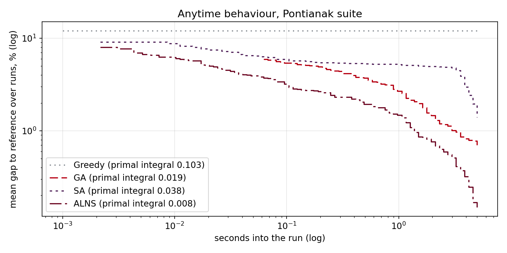

# Project progress

Status of `main`, tracked against the project roadmap. Updated 2026-09-13.

## Where this stands

The graded submission is done and unchanged. This document tracks the work *after*
that — turning a 37-cell notebook into software other people can use.

**P1 Foundation is complete, and all six roadmap quick wins are done.** §5.1's stronger
B&B bound and §6's significance testing are now in too. §2.2's playback has been rebuilt
as an interactive GSAP web page, and then rebuilt again around a real pan/zoom map after a
browser-driven design review. **§2.4 is complete**: the B&B tree explorer, the trace
instrumentation it needed — which also unblocked **Solver Vision** in the flight replay,
the one feature the brief asked for that had been deliberately left out — and the
**GA/SA/ALNS convergence dashboard**. **§2.5 is complete too**: vector export, a
colour-blind-safe theme measured rather than asserted, and — three pages overdue — a
headless-browser test harness, with one test for every bug previously found by hand.
**§3's data layer has now landed as well**: a scenario builder, instances built from the
supplied Pontianak coordinates, CVRPLIB/Solomon import and QGroundControl mission export.
The importer has since been run in anger on the Augerat A/B/P sets, which gave the project
its first external correctness evidence and settled §6's open question about GA versus
ALNS; and an OSM extract has replaced the replay page's invented city with the real one,
which is also how three geodesic defects in that page were found. Every view is documented
in [docs/VISUALISATION.md](docs/VISUALISATION.md). **§2.1's interactive planner is now in
too** — `drp serve` starts a local server, place stops and a fleet in a browser instead of
writing JSON, then solve and see the same three existing views embedded on the result. Its
stretch goals (a real-geography toggle, drawing no-fly zones, a Solver Vision toggle on the
embedded replay) are not built. The §7–8 service and most of P5 are not started.

| Phase | Status |
|---|---|
| **P1 Foundation** | ✅ **Complete** — package, formats, CLI, tests, results store, CI |
| **P2 See it** | ◐ Partial — animated playback ✅ (GIF + pan/zoom GSAP flight-replay page), B&B tree explorer ✅, Solver Vision ✅, convergence dashboard ✅, interactive planner ✅ (`drp serve`; planar only — no real-geography toggle, no-fly drawing or Solver Vision toggle yet), visualisation guide ✅, SVG/PDF export ✅, colour-blind-safe theme ✅, browser tests ✅; 3D ✗ |
| **P3 Mean it** | ◐ Partial — polygonal no-fly ✅, visibility detours ✅, ALNS ✅, dual gap ✅, stronger bound ✅, significance testing ✅; performance profiles, anytime/TTT curves, ablations, hardness correlation ✅; wind ✗ |
| **P4 Use it** | ◐ Partial — scenario builder ✅, real geography ✅, CVRPLIB/Solomon import ✅, QGC mission export ✅, geocoding ✅, OSM basemaps ✅; REST service ✗ |
| **P5 Push it** | ✗ Not started |

### The six quick wins

| # | Quick win | Status |
|---|---|---|
| §2.2 | Animated route playback | ✅ `drp show --animate` (GIF) and `--web` (pan/zoom GSAP replay page) |
| §1.4 | Split-DP brute-force test | ✅ `tests/test_split_optimality.py` |
| §4.1 | Polygonal no-fly via visibility graph | ✅ `drp/geometry/visibility.py` |
| §5.2 | ALNS | ✅ `drp/meta/alns.py` |
| §5.1 | Report the B&B dual bound | ✅ `drp/exact/bnb.py` |
| §1.5 | Results store, de-hardcoded figures | ✅ `drp/eval/store.py` |

---

## P1 — Foundation ✅

### §1.1 Package extraction

The notebook is now a frozen artefact, and the code lives in a real package:

```
drp/core/  geometry/  instances/  exact/  meta/  eval/  viz/  app/
```

`notebook.ipynb`'s original 37 cells (sections 1–12) are byte-for-byte untouched — the
marks are in and its numbers appear in the report. `tests/test_notebook_parity.py` pins
the proven optima and greedy energies it produced and fails if the package drifts from
them. Sections 13–14 were appended (not inserted) after §5.1 and §6 landed, importing the
`drp` package to demonstrate the stronger bound and the significance testing directly,
with real executed output — the graded portion stays exactly as marked, and the notebook
stays current as the project's single narrative entry point.

### §1.2 Instance and solution formats

`drp-instance/v1` and `drp-solution/v1`, both plain JSON with JSON Schemas under
`drp/instances/schema/`. Instances carry depot, customers, demands, fleet spec, energy
parameters and no-fly geometry (edges *and* polygons). Solutions carry routes, per-leg
energy and onboard weight, and a **feasibility certificate** so a third party can verify a
claimed result without re-running a solver. GeoJSON and per-leg CSV export too, and
(since §3) QGroundControl `.plan` missions. A third format, `drp-scenario/v1`, describes
the *recipe* an instance is built from rather than the instance itself.

### §1.3 Command-line interface

`drp generate | build | import | solve | compare | bench | show | export`, all exercised in CI.

### §1.4 Tests

**624 tests.** On this machine 557 pass and 67 skip: the Playwright browser suite needs `playwright install chromium`, and the 150 CVRPLIB checks need the third-party benchmark files, which are not committed. The ones the roadmap called for specifically:

| Roadmap item | Where | What it proves |
|---|---|---|
| Golden tests | `test_energy.py` | Hand-computed energies. Includes the order-dependence that defines the model. |
| Metamorphic | `test_metamorphic.py` | Reversal is free at `β=0` and generally is not at `β>0`; scaling coordinates by `c` scales energy by `c`. |
| **Split optimality** | `test_split_optimality.py` | Brute-forces **every** segmentation for small tours; Split matches exactly. |
| **B&B ground truth** | `test_bnb_ground_truth.py` | Exhaustive enumeration of every partition-into-ordered-routes; B&B matches. |
| **Bound validity** | `test_bnb_ground_truth.py`, `test_bounds.py` | Neither bound ever exceeds the true optimum — checked against brute force, and (for the anytime dual bound) at 1 ms, 10 ms and 120 s limits. |
| **Bound dominance** | `test_bounds.py` | The assignment-relaxation bound is never looser than the column-minimum sum it sits alongside. |
| Cross-validation | `test_cross_validation.py` | F2 ≤ B&B optimum always; equal when the battery is slack. Now an assertion, not a printout. |
| Feasibility fuzzing | `test_feasibility_fuzz.py` | 2,400 random solutions judged identically by `is_feasible` and an independently written reference checker. |
| **Significance machinery** | `test_stats.py` | Nemenyi CD reproduces Demšar's published table exactly for `k = 2..10`; a synthetic consistently-better method is detected as significant, a method compared against itself is not; bootstrap CI brackets a known mean. |
| **Import fidelity** | `test_benchmark_import.py` | An imported CVRPLIB file is the same problem the literature solved: depot at node 0 wherever the file put it, rounded `EUC_2D` reproduced, energy at `β=0` equal to distance, and B&B proving the value the file declares. |
| **Geographic instances** | `test_geodata.py` | Reproducible from the untouched CSV and independent of row order; distances are haversine kilometres; every instance in the suite has a feasible solution. |
| **Scenario recipes** | `test_scenario.py` | A named place resolves to that district's centroid, declared demands survive, a mistyped key is refused, and a synthetic scenario reproduces `generate_instance` exactly. |
| **External validation** | `test_cvrplib_published.py` | 74 CVRPLIB optimal solutions, produced by other people with other code, all reproduce **exactly** under `total_energy` and all pass `is_feasible`. The only check in the project that is not self-referential. |
| **Decoder equivalence** | `test_split_equivalence.py` | The rewritten Split returns the same value *and the same segmentation* as the implementation it replaced, kept verbatim as a reference — across battery-tight, forbidden-arc, zoned and geodesic instances. |
| **The rendered page** | `test_web_headless.py` | The replay page loaded in real Chrome: layers present, geometry drawn, console clean -- and a deliberately sabotaged payload that the harness must catch. The first test of the page's JavaScript, which was previously uncovered. |
| **Real geography** | `test_osm.py` | An OSM extract reads into the right layers, buildings and footways are dropped, the gazetteer prefers the larger place, and a basemap covers the instance it was cut for. |
| **Mission export** | `test_qgc.py` | The waypoints are the solved route in the solved order; a planar instance cannot be exported without an anchor; the anchor's projection measures the right number of metres. |

Bound validity deserves its billing: a bound that overestimates prunes the branch holding
the optimum, and the search then reports a **wrong answer labelled "proven optimal"**.
Nothing else in the project would catch that.

### §1.5 Results store

`results/runs.db` — SQLite, append-only, one row per run with exactly the roadmap's
columns (`instance, method, seed, time_budget, energy, feasible, nodes, wall_time,
git_sha`) plus the dual bound and the optimality flag. Every table and figure reads from
it. `run_experiments.py --tables-only` rebuilds the report tables without re-solving.

### §1.7 CI

`.github/workflows/ci.yml` — fast tests on Python 3.10 and 3.12 on every push, plus a CLI
smoke test and the full experiment pipeline. The brute-force suite runs on `main`.

---

## Quick wins, in detail

### §5.1 Anytime dual bound

`drp solve inst.json --method bnb --time 5` now prints:

```
energy   : 1504.69
status   : timed out -- lower bound 288.40, gap 80.83%
```

**This was subtle enough to get wrong once.** My first implementation recorded the bound of
the node occupied when the clock expired — which is *not* a valid global bound, because the
unexplored space also contains every sibling not yet reached, and those may be cheaper. The
correct version materialises each frame's children with their bounds before descending, and
on unwinding contributes the ones it never entered. The minimum over that frontier is a
true lower bound. `test_reported_dual_bound_is_valid` asserts it against brute force.

### §5.1 Stronger bound: assignment relaxation

The bound above was *weak* by construction — a plain sum of each customer's cheapest
entering arc, chosen independently per customer. Nothing stops two customers from
"sharing" the same cheap predecessor in the bound even though a real route cannot reuse
an arc, and the bound barely grows with `n` as a result. That flatness was exactly why
B&B stalled near `n = 9`.

`drp/exact/bounds.py::assignment_completion_bound` replaces it with an assignment-relaxation
(AP) bound: every unassigned customer, the open route's current tail, and each drone still
available to start a fresh route are matched via the Hungarian algorithm (`scipy.optimize.
linear_sum_assignment`) into a globally consistent one-predecessor-one-successor structure.
It drops subtour elimination, capacity and battery — same as before — but it cannot
double-book an arc the way the column-minimum sum can, so it strictly dominates it
(`test_assignment_bound_dominates_column_min`). Per-node cost is O(m³) instead of O(1), so
`drp/exact/bnb.py` computes the cheap sum first and only calls the Hungarian solve on
children that survive it — expensive bound, cheap gate.

Measured on the twelve committed instances (20 s each, same seeds as the table below):

| | Old bound | New bound |
|---|---|---|
| `S6_n10_k3` nodes to prove optimal | 1,519,663 (9.0 s) | 428,850 (13.9 s) |
| `S6_n10_k3` proves optimal in 20 s? | ✗ (this is where the old ceiling sat) | ✅ |
| `S5_n9_k3` nodes to prove optimal | 195,022 | 36,945 |
| Unproved interval at `n = 25–30` | 86–89% | 72–73% |

The exact-solvable ceiling moves from `n ≈ 9` to `n ≈ 10` — one step, not a leap, because
the bound is still a relaxation with no subtour elimination. Held–Karp or the LP relaxation
of the flow formulation remain the path to a bigger jump and are still not done.

**A phantom-return bug this exposed.** Tightening the completion bound broke three ground-truth
tests: B&B reported "proven optimal" at an energy *above* the true brute-forced optimum on
`n = 7` — the exact failure mode this project treats as the most serious possible bug, a wrong
answer with a confident label. The cause pre-dated this bound and was latent in the original
one too, just never tight enough to trigger it: the "committed cost so far" for the *still-open*
route was computed with `route_energy`, which bakes in a return-to-depot leg from whichever
customer currently happens to be last. If the route goes on to take more customers, that leg is
never actually flown — it's replaced by a longer path through the rest of the route — so
charging it is phantom cost with no lower-bound justification. Once stacked on a genuinely tight
completion term, phantom-plus-completion could exceed the true remaining cost and prune the real
optimum. Fixed by adding `drp.core.energy.route_energy_open` (every real leg except the
not-yet-flown return) and using it for the open route's running total in the bound, while the
return leg is charged exactly once — either when a route genuinely closes, or as one of the
assignment bound's own candidate arcs. `tests/test_bounds.py` now checks this directly, and
`test_bnb_ground_truth.py` is what caught it in the first place.

### §4.1 Polygonal no-fly zones

A blocked edge is no longer deleted; the drone flies **around** the obstacle. Zones are
polygons; a leg crossing one is replaced by the shortest obstacle-avoiding path, computed
on a visibility graph (nodes = depot + customers + polygon vertices, edges = mutually
visible pairs) and folded into the distance matrix.

**No solver changed.** B&B, GA, SA and ALNS all work unmodified on zone instances — verified
end to end in `test_geometry.py`, along with a hand-computed detour around a unit square.

### §5.2 ALNS

Destroy (random / worst / Shaw / whole-route) + repair (greedy / regret-2 / regret-3) with
adaptive operator weights and annealing acceptance. On the twelve synthetic instances it
ties SA for the best average energy (1002.7 each, against the GA's 1015.3) while recovering
every proven optimum.

The roadmap expected it to "beat both current metaheuristics comfortably". On this suite
*comfortably* is too strong -- the three are statistically indistinguishable here
(p ≥ 0.0625), and SA edges it on `L2_n25_k6`. The comfortable win is real but it is
elsewhere: on **74 Augerat instances ALNS beats the GA at p = 2.0 × 10⁻⁸**, and on
**168 Solomon instances it beats both at every size** (rank 1.14 of 4). Twelve instances
were never going to settle it.

*Superseded text, kept deliberately:* this section used to read "both clearly beat SA at
scale", on 1103.7 against ALNS's 1027.7. That was a comparison against a broken cooling
schedule (§5.4), not against simulated annealing.

**It took three fixes to get right, and the first study run caught it.** The initial
implementation found only 3 of 5 proven optima (1.20% average gap) while GA and SA found
all 5 — on `S4_n8_k3` it returned *exactly* the greedy value, having never improved in 25
seconds. Rather than report that as a curiosity, it was worth diagnosing:

1. **Deterministic repair.** Measured directly: 400 destroy-and-repair rounds produced only
   **4 distinct tours**. Greedy and regret insertion are deterministic given the remaining
   tour, so the search kept regenerating the same solutions. Fixed with the standard ALNS
   noise term (Ropke & Pisinger 2006): each candidate position is offset by
   `noise · max_distance · U(−1,1)`. → 4/5.

2. **Destroy range too narrow.** A percentage ceiling alone is far too tight when `n` is
   small — 40% of 8 is 3. Added an absolute floor of 2 (removing one customer and greedily
   reinserting it usually just puts it back) and let the ceiling reach 8, capped at `n − 1`.

3. **The repair optimised the wrong objective.** This was the real one. Insertion positions
   were scored by pure distance detour — which ignores the load-dependent energy that is
   the entire point of this problem. Because a drone loads its whole route at the depot,
   placing a customer later in a route means hauling its parcel across every leg before it.
   The cost function now charges `β · q_c · (distance already flown before the position)`
   alongside the detour. → **5/5 proven optima.**

Worth stating plainly: an exhaustive search over all 40,320 giant tours confirmed 670.5
*was* reachable on `S4`, and ALNS was running 7,256 iterations against SA's 14,479 — so
this was never iteration starvation. It was a search converging efficiently to the wrong
place, which is exactly the failure mode a "it's a metaheuristic, it's stochastic" shrug
would have hidden.

### §2.2 Animated playback

`drp show --animate flight.gif` renders the fleet on a shared clock — drones moving
simultaneously, batteries draining, trails building, and a **red flash when two drones pass
within the separation distance**. Nothing enforces separation yet (that is §4.5), so those
flashes are precisely the conflicts a deconfliction model would have to resolve.

### §2.2 Interactive web playback

`drp show sol.json --instance inst.json --web flight.html` renders the same story as a
single self-contained HTML file — open it directly in a browser, nothing to serve.

This has been through three passes. The first was a sci-fi mission-control HUD, rejected
as generic. The second built a grounded aviation-chart identity on top of it. The third
(driven by `drone_delivery_visualisation_gsap_brief.md`, and by inspecting the running page
in a browser rather than reasoning about the source) found that the second pass still read
as a diagram with icons on it, and rebuilt the map and interaction layers outright.

**What the third pass changed.**

- **The map is a map you can handle.** Drag to pan with release inertia, wheel-zoom toward
  the cursor, pinch on touch, `+`/`−`/reset controls, arrow keys and `0`. A live scale bar
  and coordinate readout track the camera, and the graticule picks "nice" intervals per
  zoom level. Stops, aircraft, the hub and place labels counter-scale so they hold a
  constant *screen* size while the terrain zooms; route strokes hold a constant screen
  weight the same way. This was the single biggest gap — the previous version's camera
  moved only when the code moved it, which is not what anyone expects from a map.
- **The basemap was redrawn, not decorated.** It had been a jittered street grid with
  building rectangles scattered on it, which at any zoom read as noise. It is now composed
  like an aeronautical sheet: a river with banks and bridges where arterials cross it,
  land-use polygons for built-up areas and parks, and a **radial + ring road network
  centred on the hub**, so the road layout itself says where the depot is. Streets and
  buildings are masked to dry, built-up land. District labels are placed with collision
  rejection, so two names can never overprint. Still seeded deterministically from the
  instance, so it stays reproducible.
- **Delivery stops became the content layer.** They were house glyphs indistinguishable
  from the building texture — genuinely invisible mid-flight, which is a serious failure
  for the one thing the problem is *about*. They are now numbered chart symbols pinned to
  their exact coordinate, with four legible states: pending → inbound (pulsing) →
  delivering (radial burst) → delivered (green, checked).
- **The timeline became an instrument.** One lane per drone showing its airborne span with
  its delivery ticks inside it, event diamonds embedded in the track, a NOW playhead,
  drag-anywhere scrubbing and keyboard seek. Seeking backwards un-fires events, so the
  replay stays a replay instead of an ever-growing tally.
- **The rail carries the solver's story**, not just the fleet's: objective, flown distance,
  drones used, battery/payload limits, separation minimum, certificate reason — beside a
  live event stream. Clicking a drone still dims the rest, frames its route, redraws its
  trail so you *discover* the path, and opens a "why this route" panel built from
  `certificate.routes[k]` and the per-leg trace, now also showing the straight-line vs
  flown distance and the resulting airspace detour cost.
- **Restricted zones** keep the magenta aeronautical convention, but the hatch skirt is
  clipped to the polygon interior (it used to fringe outside the boundary) and a zone
  pulses when an aircraft comes near it.
- A `Fleet sweep` button gives the page one signature move: pull back, brighten every
  route, redraw them from the hub outward, settle exactly home. Everything still respects
  `prefers-reduced-motion`, and the layout holds down to 430 px.

**Four real bugs the browser inspection surfaced**, none of which the Python-side tests
could have caught:

1. **Deliveries fired at the wrong moment.** The service distance came from summing
   `leg.distance`, but the aircraft flies `route_polyline`, which is *longer* whenever it
   detours around a no-fly zone. The marker therefore flipped to delivered before the drone
   arrived — precisely on the instances where the geometry matters most. Now read off the
   flown polyline by matching each customer's coordinate to its vertex.
2. **Six separation breaches at `d=0`.** Every drone departs the same point at the same
   instant, so the whole fleet is inside the separation minimum before it has flown
   anywhere. The page opened reporting six conflicts on a feasible, conflict-free solution.
   Separation is now assessed only once an aircraft has cleared a terminal-area radius —
   and that radius is **displayed in the solver panel** rather than quietly applied, since
   it is an assumption the model does not itself make. Predicted breaches on the sample
   instance: 0.
3. **The map painted over the rail.** `.map-panel` had `aspect-ratio` while its grid row
   stretched to the tallest item, so the *height* fed back into the *width*: once the event
   log grew past the map, the map widened and covered the manifest. The rail is now
   height-bound to the map and scrolls internally.
4. **A tween that never died.** `setDelivered` cleared the inbound pulse via
   `setApproaching(id, false)`, whose guard had already seen `delivered === true` and
   returned before killing the tween — leaving a ring expanding forever around every served
   stop. Plus: drone markers didn't re-scale when zooming while paused, because their
   transform was only written by the per-frame `render()`.

Python's only job is still producing one JSON payload (`drp/viz/webdata.py`) — **unchanged
across all three passes**, because every one of the above reads fields that payload already
had. All choreography lives in `drp/viz/web/playback_template.html`. That split is
deliberate: §2.4's B&B tree explorer below reuses the same data-in/choreography-out
pattern, and the SA/GA dashboards will too.

**Solver Vision** (candidate routes considered and rejected) was deliberately absent
through all three of these passes: the brief asks for it and it is the most persuasive
feature on the page, but B&B, GA and SA exposed no intermediate search states, and the
brief's own rule — do not fabricate what the solver does not produce — made faking it the
wrong move. It was blocked on trace instrumentation, not on the front end. §2.4 below built
that instrumentation, and Solver Vision is now in.

On coverage: `tests/test_viz_web.py` pins the **Python** side —
one flight per used route, cumulative distance agreeing with `route_energy`/`route_weight`,
detour-aware polylines, the separation default matching `animate_routes`, and placeholder
substitution. There was no browser test harness when this was written, and the four bugs
listed were found by driving the page by hand. **That gap is now closed** —
`tests/test_web_headless.py` loads the page in real Chrome (see §3.4 below) — though it
covers rendering, not interaction: nothing yet drags the camera or scrubs the timeline.

Earlier correctness bug, still worth recording: several lookups (`rows[f.drone]`,
`DATA.flights[id]`, `DATA.solution.routes[id]`) originally assumed array index equals drone
id. That only holds when every drone has a non-empty route — `build_playback_data` lists
only *used* routes, so an idle drone partway through the fleet would silently misalign every
later drone's marker, telemetry row and "why this route" panel. Fixed by looking up
everywhere via the real `drone` field.

### §2.4 B&B search-tree explorer

```
drp tree inst.json --time 20 -o tree.html
```

`solve_bnb(..., trace=True)` now records the search: one `BnBNode` per call to `recurse`,
carrying the partial assignment, the node's lower bound, the incumbent standing at that
moment, and how the node ended (`expanded`, `pruned_bound`, `infeasible`, `new_incumbent`,
`dominated`, `timeout`). Each node also lists every branching option it *considered*,
including the ones that never became nodes at all — cut for a forbidden arc, an
over-payload or over-battery route, the symmetry break, or a sterile bound.

That last part is the interesting half. At `n=7` the search **entered** 2,041 nodes but
**considered** 5,107 options; 1,722 of those died on the symmetry break alone and 692 on
the bound, and none of them appear in `nodes_explored`. Most of the pruning is invisible in
the aggregate the solver used to report, and it is exactly what "why did the search never
go down there" means.

The hook is opt-in and off by default — every recording site sits behind one `tr is not
None` test — because `bench` and `compare` run under a time limit and must not regress.
`bound_child` had to change shape (it returns `(bound, survives)` instead of
`Optional[float]`, so the trace can report *what* condemned a cut child), and `survives` is
exactly the old "is not None" test, so the same children are generated and
`nodes_explored` is unchanged. Recording stops at `trace_max_nodes` and sets `truncated`;
the search itself always runs to completion, and a capped run returns exactly what an
uncapped one returns.

**The page.** Same data-in/choreography-out split as §2.2: `drp/viz/treedata.py` emits one
JSON dict, `drp/viz/web/tree_template.html` owns every layout and camera decision. The tree
puts **expansion order across and depth down**, so the horizontal axis is the scrubber's
axis — the playhead sweeps left to right through real search time and a node's subtree sits
immediately to its right. Nodes are filled and their edges coloured by lower bound on a
ramp from the root bound to the final incumbent; radius grows with slack against the
incumbent of the moment; a ring says how the node ended. The bands of solid magenta at
depth are the answer to "why didn't it search there". Clicking a node shows its partial
routes on a small map — closed routes with their return leg, the open route without one,
because `route_energy_open` does not charge one either — plus the options it rejected as
ghost legs coloured by reason.

**One derived series, derived by the solver's own rule.** The rail's "bound closing on
incumbent" chart needs the dual bound at each step, which the trace does not store. It is
computed in the browser as the minimum over every node generated but not yet expanded —
literally the rule `solve_bnb` uses for its reported `dual_bound`, including keeping a
timed-out node on the frontier and adding its stranded siblings at the moment of the
timeout. `tests/test_viz_tree.py` reimplements that rule in Python and asserts the series
lands on `BnBResult.dual_bound` exactly, timeout included. Without that test the curve
would be a plausible picture of a search that never happened.

### §2.4 Solver Vision

```
drp show sol.json --instance inst.json --web flight.html --vision
```

The feature §2.2 deliberately left out, now that there is a trace to build it on. With it
toggled on, selecting a drone draws the options the search considered and rejected at each
point along that drone's route: thin low-opacity ghost legs under the flown route, coloured
by why they were cut, with the node id and bound on hover.

Matching is on **full state** first — the node whose closed routes are the drones already
finished and whose open route is this prefix, i.e. the search building this very solution.
That node is deep on the winning path, working against a strong incumbent, so it actually
rejects things. Falling back to the open-route prefix alone lands on the *first* node to
reach that prefix, which has no incumbent worth the name and explores nearly everything;
those matches are still shown, labelled `(prefix)`.

The honest cases are the point. Replaying B&B's own optimum at `n=7` gives `7/7 route steps
matched a node (7 exact)`. Replaying an **ALNS** solution against a B&B trace that timed out
at `n=14` gives `5/14 (0 exact)` — and the two unmatched drones say so in words: *"The
search never stood at any point on this route, so it has nothing to say about it."* The
solver panel carries the provenance beside the numbers: how many steps matched, how many
exactly, how big the search was, whether it timed out, whether its trace was capped. No
candidate is ever synthesised.

### §2.4 One real finding about the bound

Writing the test the roadmap asked for — *bounds along any root-to-leaf path are
non-decreasing* — found that they are **not**, and the exception is real rather than a
tolerance problem.

`bounds.assignment_completion_bound` returns 0 for an empty completion set. So at the one
branching step that empties the unassigned set, the bound stops charging the
return-to-depot arc that the parent's assignment relaxation had priced, and can fall by up
to that arc's cost. Measured across four instances: **39 of 32,887 transitions, every one
of them into a leaf, none anywhere else.**

This is not a correctness bug — the bound only ever gets *looser* there, so the optimum is
never pruned, which is what `test_bnb_ground_truth.py` verifies end to end. But it is not
monotone, and the test now says so precisely: monotone at every step that leaves work to
do, only leaves may dip, and — the claim that actually matters —
`test_a_leaf_cost_never_undercuts_an_ancestor_bound` asserts that the realised cost of a
complete assignment is never below any bound on the way down to it. Tightening the bound to
charge that arc would change `nodes_explored` and the committed run's numbers, so it was
left alone and written down instead.

### §2.4 Convergence dashboard

```
drp dash inst.json --methods ga,sa,alns --time 5 -o dash.html --reference 10
```

The other half of §2.4. All three metaheuristics already carried
`history: List[float]` — best-so-far, subsampled — which is enough to draw a monotone
staircase and nothing else. `drp/meta/trace.py` adds one shared trace shape for all three,
on the same terms as the B&B trace: opt-in, off by default, one guard per site.

What `history` could not show, and now does:

- **SA** looks like SA because of the *working* solution wandering above the best-so-far,
  and the temperature driving how far it may wander. Both are recorded, reheats marked.
- **ALNS** is adaptive, and the thing worth watching is the operator weights moving as it
  learns. Only the *final* weights were reported; now one record per weight update carries
  the weights, the draw counts and the scores that produced them.
- **GA** is a population, and a best-of-generation line says nothing about whether it
  converged or collapsed. Samples carry population mean and spread — over the *feasible*
  members only, since Split returns `inf` for a tour no fleet can serve and one `inf` would
  swallow the mean.

**Bounded by decimation, not truncation.** A 5 s SA run does ~8,700 iterations. The tracer
keeps every stride-th step and, when the buffer fills, drops every second sample and
doubles the stride — so the buffer is a *uniform* sample of the whole run at all times, at
O(1) amortised cost. Truncating to the first N points instead would show the opening of the
search and nothing after it, which for a convergence curve is the one useless shape.
Improvements and reheats are recorded separately and in full, so no marker is ever dropped.

**Where the invariance claim actually falls.** For a **fixed** iteration/generation budget
the trace changes nothing — same solution, energy, history and counters, asserted for all
three across three seeds. Under a **wall-clock** limit it is not true and is not claimed:
recording costs time, so fewer iterations fit, exactly as any other overhead would. That is
why `bench` and `compare` leave it off, and why every invariance test pins a fixed budget
and a generous clock.

**The page** puts all three methods on one pair of axes, which needs two things handled
rather than assumed. Wall-clock seconds is the default x-axis, because one GA generation
evaluates `pop_size` tours and one SA iteration evaluates one; the step axis is still
offered and is labelled *not comparable across methods* when selected. And the vertical
range fits the best-so-far curves rather than everything — an SA working solution wanders
far above every answer, and a range containing it squashed all three bests into a band a
few pixels tall, which was the one thing the chart existed to show.

`--reference SECONDS` runs B&B too and draws a floor. If B&B proves optimality that floor
is the optimum; if it does not, the floor is its **dual bound** and is labelled as such,
because an unproven incumbent is not a floor and drawing it as one would misstate what is
known.

### §2.4 What the dashboard found about SA

The first thing the view was pointed at, it answered — which is the point of building it.

On the n=14 worked example SA reports 1214.7 against GA's 1095.4 and ALNS's 1119.5, and its
panel reads **`Improvements on the start: 0`**. It never beat the greedy warm start it was
handed, in 8,700 iterations.

That is not a one-instance accident. Measured at a 3 s budget, warm-started from
`best_construction`, improvement counts summed over seeds 1–3:

| Instance | Warm start | SA best | SA improvements | ALNS | GA |
|---|---|---|---|---|---|
| n=10, K=3 | 954.0 | **851.2** | 16 | 851.2 | 851.2 |
| n=14, K=4 | 1155.5 | 1085.8 | 2 | 1029.8 | 1029.8 |
| n=20, K=5 | 2200.7 | 1843.7 | 1 | 1700.4 | 1680.6 |
| n=25, K=6 | 2299.3 | 2085.7 | 0 | 1959.8 | 1919.2 |

At n=10 SA matches ALNS and GA exactly. By n=25 it makes no improvement at all, and the gap
to the other two is ~7%.

The temperature panel shows the likely mechanism. `solve_sa` calibrates `T0` once from 60
random-neighbour deltas so early acceptance is ~0.8, then cools at `gamma=0.9995`. Over
8,700 iterations that would take `T` to about 1.3% of `T0` — cold enough to consolidate.
It does not get there: `reheat_after=4000` fires twice in a 5 s run, and each reheat resets
`T` to `T0 * 0.5` *and* throws the working solution back to the incumbent. The trace ends
at `T ≈ 235` against energies around 1,200, i.e. still accepting almost anything. SA spends
the whole budget in a near-random walk and never gets to exploit.

**Not changed here, deliberately.** Retuning `gamma`, `reheat_after` or the calibration
would move `SAResult` on every instance, and the committed run's numbers and
`test_notebook_parity.py` are pinned to the current behaviour. It is written down as a
measured finding with a mechanism, and belongs with §6's ablations rather than in a
visualisation change.

**Resolved since, and the two diagnoses differ in an instructive way.** §5.4 below fixed
it, arriving at the same wall from the opposite direction: Solomon, where SA returned its
warm start on all 56 instances. The dashboard's reading above is that cooling *would*
finish in 8,700 iterations but reheats keep resetting it; the Solomon reading is that on
larger instances only ~1,400 iterations fit in the budget, so it never finishes cooling at
all. Both are true, and they are the same defect seen at two scales -- a schedule that
counts iterations inside a loop that counts seconds. The fix re-derives the cooling rate
from the measured iteration rate, including immediately after each reheat, which covers
both. The deferral's own premise has also expired: the committed run has since been
re-measured, and `test_notebook_parity.py` pins B&B optima and greedy energies, neither of
which SA touches.

Worth reading the table above with that in mind. Its `n = 25, K = 6` row -- 0 improvements,
2085.7 against ALNS's 1959.8 -- is the same instance that now reads 1645.4 for SA in "The
committed run", better than ALNS's 1651.9. The dashboard was right about the mechanism and
right to record it; what it could not see was how much was being lost.

### §2.4 What the browser found this time

Eight things, none visible in the source and all obvious on screen — the same lesson as
§2.2. **In the tree explorer:**

1. **The tree rendered as a black mass with no nodes in it.** Every node's incoming edge
   lived inside that node's own `<g>`, so each later edge painted over every earlier
   circle. Edges and circles are separate layers now, and edges are coloured by the bound
   of the node they feed, which turns the mass of strokes from noise into the bound field
   itself.
2. **Three temporal-dead-zone crashes.** `readout` and `visionStroke` are read during
   camera setup and `playing` during the first `setT`, all before their `let`/`const`
   declarations execute. Note that `typeof x !== "undefined"` does *not* guard this — on a
   `let`/`const` in its TDZ, `typeof` throws too.
3. **"Next improvement" was dead on arrival**, because the page opens with the playhead at
   the end of the search where there is no next improvement. It wraps now, and the page
   opens on the node that produced the answer rather than the root, which had the inspector
   contradicting the playhead.
4. **The rail was height-bound to the tree**, hiding the mini map behind an inner
   scrollbar. The tree panel stretches to the row instead — safe here, unlike §2.2's bug,
   because the rail's height does not depend on the tree panel's width.
5. **The colour encoding collapsed on the run where it mattered most.** A search that times
   out without ever finding a feasible solution has no incumbent, so the ramp
   root-bound-to-incumbent had zero span and every node came out the same colour — in
   exactly the run where the bound is the only thing there is to look at. The ramp falls
   back to the range of bounds actually recorded, and the legend prints both ends as
   numbers and says which it is showing.

**In the convergence dashboard**, all three about the vertical axis, which turns out to be
where a multi-method chart goes wrong:

6. **All three answers squashed into an illegible band.** The y-range contained SA's
   working solution, which wanders far above every best-so-far curve — so the curves the
   chart exists to compare occupied a few pixels at the bottom. The range now fits the
   best-so-far series, working solutions are clipped, and the page names the curves it
   clipped rather than letting the legend promise a line the reader cannot find.
7. **The reference floor spent half the plot proving a gap.** On a hard instance B&B's
   dual bound sits far below every method, and including it in the range left ~55% of the
   chart empty. In `fit best` it is now an edge marker plus a per-method gap percentage —
   a number is the better way to read that gap; `fit all` still gives it the axis.
8. **Every readout said `–` at the natural starting position.** The x-domain began at 0
   but the first sample lands a few milliseconds in, so pressing `Home` landed in a sliver
   where no method had produced a sample. The domain starts at the first real sample now.

And one found by writing the guide rather than the code: **none of the pages degrades when
its CDN is unreachable — they do not render at all.** Every element is built by their
script and that script needs GSAP, so an offline user got a shell of empty panels and no
explanation. All three now detect the missing library and say what happened.

### §2.4 Coverage

`tests/test_bnb_trace.py` (53 tests) treats the trace as a claim about the search rather
than a data structure to smoke-test: one record per node entered, every parent id present,
candidate→child links real in both directions, child states composing from parent state and
candidate, pruned nodes genuinely dominated by the incumbent they were compared against,
and — the one that protects everything else — identical solution, energy, node count and
dual bound with tracing on and off.

`tests/test_viz_tree.py` (17 tests) covers both payloads: the explorer's geometry covers
every leg it can be asked to draw and detours where the distance matrix detours, the
derived dual-bound series lands on the solver's own, and Solver Vision never reports an
option that was taken.

`tests/test_meta_trace.py` (33 tests) does the same for the metaheuristic traces —
fixed-budget invariance for all three, ordering and end-state, every improvement recorded
as an event, SA's temperature falling except where it reheats, ALNS's final segment
matching the weights the solver reports, and decimation staying uniform and never dropping
an event. `tests/test_viz_dash.py` (12 tests) covers the dashboard payload: the shared axis
limits contain every series, the three numbers that must agree do, and no method may report
an energy below a proven optimum.

**280 tests** at this point, and still no browser test harness — none of the JavaScript
above was covered by CI, and every bug listed was found by driving the pages in Playwright
by hand. §2.5 below closes that: `tests/browser/` now drives all three pages in headless
Chromium, with one test named after each of those bugs.

### §2.5 Vector export

`drp show -o routes.svg` works, and so do `.pdf`, `.eps` and `.ps`. There is no
`--format` flag and there does not need to be one: matplotlib reads the suffix, and the
single save point only had to stop forcing a raster dpi on a vector target. Two details
that are not obvious: matplotlib stamps a creation date into SVG and PDF, which makes
every regeneration a diff, so both are stripped; and `dpi` is now applied to raster
targets only.

`generate_figures.py` writes every figure **twice**, as PDF and PNG. PDF rather than SVG
because `report/report.tex` is built with pdflatex, which embeds a PDF directly, while an
SVG needs `--shell-escape` and an Inkscape on the build machine — a dependency the report
does not otherwise have. The `\includegraphics` calls lost their `.png` suffix, so LaTeX
takes the PDF and falls back to the PNG if the vector file is missing. PNG stays because
plenty of things that are not LaTeX read these files. SVG is one flag away (`--formats
svg`) and is not written by default because nothing in the repository consumes it.

**TikZ: considered, rejected, written down rather than half-added.** Over PDF it buys
exactly one thing — figure text set in the document's own font, at the document's own
size, by the same typesetter. It costs a matplotlib-to-TikZ dependency, a build that can
now fail inside LaTeX rather than inside Python, and tens of thousands of generated lines
of `.tex` per data-heavy figure; `fig_comparison` alone draws 60 bars. If the report ever
does need figure text to match exactly, the cheap half of that is matplotlib's own `pgf`
backend, which needs no new Python dependency.

### §2.5 What vector output exposed

The roadmap's warning was right, and the specific number is worse than expected. A figure
drawn 7.5 inches wide and placed at `0.65\textwidth` — 4.09 inches in this report's A4,
2.5 cm-margin geometry — is shrunk to **0.55** of its size by LaTeX. That takes 11 pt text
to 6 pt and an 8 pt customer label to **4.4 pt**. Across the seven figures the range was
4.3–5.8 pt for annotations and 5.4–7.2 pt for tick labels: below any readable floor.

At `dpi=150` this was invisible, and that is the interesting part. A 4 pt label rasterises
to a grey smudge that reads as "fine print", and nobody looks closer. In vector it is
crisp, and unmistakably too small. The raster output was not hiding a rendering bug; it
was hiding a *typographic* decision nobody had made.

Fixed by having each figure declare the fraction of `\textwidth` it is printed at
(`generate_figures.py`'s `PLACED_AT`, which has to stay in step with the
`\includegraphics[width=…]` calls) and sizing type and strokes so they land at 9 pt
headings, 8 pt ticks and 7 pt annotations *on the page*. Line widths and marker sizes scale
with them — a 1.8 pt route stroke shrunk to 1.0 pt is a hairline, and a hairline is the
first thing to disappear in print. Annotation *offsets* scale too, which was needed as
soon as the type grew: bigger labels sat on top of their own markers.

`drp show` passes no `placed_at`, because a figure someone asked for by name is not going
into that report.

### §2.5 A colour-blind-safe theme, measured

`drp/viz/theme.py` holds both palettes; `--theme`, `DRP_VIZ_THEME` and a `theme=` argument
on every drawing entry point select one. `safe` is the default; `chart` is the original,
every hex unchanged. Be precise about what that promises: it restores the *palette*, not a
pre-§2.5 figure, because the type resizing below applies to both themes. The pages no
longer carry a palette of their own: the theme travels in the JSON payload and is written into the CSS
custom properties at startup, so **one Python constant now colours all five views**.

"Safe" is a claim until something measures it, so `drp/viz/cvd.py` implements the standard
simulation — Viénot, Brettel & Mollon (1999) for protanopia and deuteranopia, Brettel,
Viénot & Mollon (1997) for tritanopia — and CIE76 dE\*ab for the distance.

The old palette, simulated. Its worst pair:

| Vision | Closest pair, dE | Which |
|---|---|---|
| normal | 26.2 | blue / purple |
| protanopia | 9.4 | blue / purple |
| **deuteranopia** | **7.8** | **red / green** |
| tritanopia | 16.4 | green / purple |

dE 7.8 is "the same colour with a bad print". `safe` scores **29.5** at its worst pair
across all three deficiencies, every colour clears 3:1 contrast against the page
background, and the route colours are held clear of the *semantic* ones so no hex means
two things. `results/fig_theme.pdf` draws both palettes as each kind of vision receives
them; the dashboard's method colours (purple / red / blue, whose red and blue collapse
under protanopia) and the replay's delivered-green / breach-red pair are fixed by the same
switch.

**Two things worth recording about how this was arrived at.** First, hand-picking a
palette that *looks* safe does not work: a designed set of navy / vermillion / teal /
purple / amber / sky measured **4.2** under protanopia — worse than the palette it was
meant to replace. It was replaced by a maximin search over a contrast-filtered grid, and
the result is machine-derived rather than hand-chosen, which is the honest description.
Second, published "colour-blind safe" sets are not automatically safe *here*: measured on
this cream background, Paul Tol's *bright* scheme collapses to dE 1.4 under tritanopia and
ColorBrewer *Dark2* to 4.5 under deuteranopia. Half of Okabe–Ito fails the contrast floor
outright, because it was designed for white.

### §2.5 One real finding about the bound ramp

The roadmap guessed the tree explorer's teal → amber → magenta ramp was "already close to
safe" and asked for it to be checked rather than assumed. Checked, it is **not safe, and
the failure is worse than a confusable pair**. A sequential ramp has to be monotone in
perceived distance from its own start, or a high value looks like a low one. Sampled at
nine points, dE from the first stop:

| Vision | first → last |
|---|---|
| normal | 0 → 12 → 27 → 43 → **60** → 56 → 57 → 65 → 76 |
| protanopia | 0 → 11 → 23 → 35 → **46** → 31 → 17 → 14 → 28 |
| deuteranopia | 0 → 13 → 28 → 43 → **58** → 45 → 30 → 15 → **9** |
| tritanopia | 0 → 8 → 19 → 32 → **50** → 46 → 51 → 56 → 59 |

Under deuteranopia the ramp's far end lands dE 9 from its near end while its middle is 58
away: it folds back, and the highest bounds are drawn in the same colour as the lowest —
in the one view where the bound is the entire point. It is not monotone for **any** of the
four, normal vision included; the deficiencies only make an existing flaw severe. `safe`'s
ramp is navy → violet → amber, monotone under all four, spanning at least dE 63.

### §2.5 Colour is never the only channel

No palette helps a monochromat, and none survives a fax, so every theme carries a dash
pattern, a marker shape and a bar hatch indexed on the same number as the colour. Routes
get a dash in the static plot, the GIF and the replay — and the manifest row's spine
repeats it. Methods get a dash and a marker everywhere, and the dashboard's legend rules
are drawn as tiny SVGs so they carry the *exact* pattern the curve does. Tree node
statuses get a ring dash, which matters most there because the fill under the ring is
itself a ramp colour. Bars get a hatch. Delivered is a filled disc with a tick, pending an
empty outline, a breach a dashed ring with the numbers beside it.

The second channel is identical in both themes, so switching theme changes only the
colour and a figure's *shapes* stay comparable.

**What it does not fix, stated plainly.** Six route colours, five semantic ones and a
sequential ramp cannot all be mutually far apart at 3:1 contrast on a cream page. The
tightest route-versus-semantic pair in `safe` is dE 11.2 — a dark red route against the
crimson a breach flashes in. That is a limit, not an oversight, and it is exactly why the
shapes above exist.

**One behaviour change.** `drp/viz/static.py` and `drp/viz/dashdata.py` held two
*different* method-colour maps: static's `ga` was blue, dashdata's was purple. The theme
unifies them, so `--theme chart` draws the dashboard in static's mapping rather than
dashdata's. No committed figure moves — those all come from `static.py`.

### §2.5 A browser test harness, three pages overdue

`tests/browser/` — **70 tests** across the three pages, in headless Chromium. What they
assert beyond "it rendered": no page error and no console error, the GSAP guard did not
fire, panels are populated rather than empty shells, the numbers on the page are the
numbers in the payload that produced them, play advances and scrubbing seeks and selection
fills the inspector and the axis and fit toggles change the chart, and nothing overflows
sideways at 430 px.

And one test per bug found by hand, named after it:

| Test | The bug |
|---|---|
| `test_no_uncaught_errors_anywhere_on_load` | The three temporal-dead-zone crashes. They threw *and* left a partly built page, so an element-counting smoke test would have passed |
| `test_next_improvement_wraps_instead_of_doing_nothing` | "Next improvement" dead on arrival at the end of the search |
| `test_fit_best_does_not_squash_the_curves_into_a_band` | Measured: `fit best` gives the best-so-far curves 79% of the plot height, `fit all` 2%. Anything under a quarter is the bug back |
| `test_home_does_not_leave_every_readout_empty` | Every readout `–` at `Home` |
| `test_edges_and_nodes_are_in_separate_layers` | The tree as a black mass with no nodes in it |
| `test_seeking_backwards_un_fires_events` | The documented promise nothing enforced |
| `test_the_rail_is_height_bound_to_the_map_on_desktop` | The map painting over the manifest |
| `test_the_mini_map_is_not_hidden_behind_a_scrollbar` | The tree explorer's rail bound the wrong way |

**Three harness decisions.** GSAP is served from a local cache rather than the CDN, so a
network hiccup cannot look like a test failure; fonts are fulfilled *empty* rather than
aborted, because an aborted request logs a console error and the console-error list is
supposed to be empty. Pages load with `prefers-reduced-motion: reduce`, so the DOM reaches
its final state on the first frame and no assertion races an intro tween — with one test
loading with motion on and asserting it settles in the same place, which is the only thing
that has ever actually checked that claim. And the tree fixture runs `--no-warm-start` on
purpose: with a warm start the search often has no improvements, and the button whose
deadness is being tested would have nothing to do.

**Writing them found one more bug — in the test tooling, not the product.** The first
tritanopia implementation applied Brettel's separation plane in LMS, where its normal is
defined in linear RGB. Mid-grey came out `#3A4500`. A neutral grey must be fixed under
every simulation, `test_simulation_leaves_neutral_greys_alone` says so, and it caught it.
Every number in this section is from the corrected transform.

**In CI**, they run in their own job on **every push and every pull request**, not only on
`main`: the whole reason the job exists is that JavaScript regressions are invisible in
review, and deferring it to `main` means a pull request can break a page and merge green.
Honest cost — ~40 s to install, ~25 s for Chromium on a cache hit (90 s cold, once per
Playwright version), ~60–75 s for the tests: **about 2 minutes warm, 3 cold**, in parallel
with the existing jobs. They are marked `slow` as well as `browser` so `-m "not slow"`,
the fast subset, is unchanged.

### §2.5 Coverage

`tests/test_viz_theme.py` (33 tests) treats the theme as a claim rather than a constant.
The simulation is checked first, against behaviour that does not come from this repository
— neutral greys fixed, red and green collapsing onto one yellow under protanopia and
deuteranopia and *not* under tritanopia, blue untouched by protanopia and destroyed by
tritanopia. Then the claims: the safe palette's worst pair, its contrast on the page, that
no colour carries two meanings, that the ramp is monotone under all four, that the second
channel exists and is unique per series, and that `chart`'s hexes are still the original
ones. Vector export is covered too: the extension chooses the format for `.png`, `.svg`,
`.pdf` and `.eps`; the two themes produce different files; `placed_at` changes the type
and not the figure's dimensions; and regenerating a figure gives the same bytes.

`tests/browser/` (70 tests) is described above.

**390 tests**, and for the first time the JavaScript is among them.

### §2.1 The interactive planner

```bash
drp serve
```

`drp serve` starts a small local HTTP server (stdlib `http.server`, bound to
`127.0.0.1` only), opens a browser, and lets someone place delivery stops on a
map, set the fleet, and solve -- without hand-writing an instance file first.
It is the last significant unstarted piece of P2, and the only one of the six
views that is a running program rather than a file.

**The architecture is one rule: nothing about the existing views changes.**
The browser only ever talks to this server; every solve happens here, in
Python, through the same functions the CLI already uses --
`drp.eval.runner.solve_one` for the first ALNS look, `solve_ga`/`solve_sa`/
`solve_alns`/`solve_bnb` directly for the dashboard and tree tabs. Placing
stops and clicking Solve builds an ordinary `drp-instance/v1` document
client-side and posts it; the server loads it through `instance_from_dict`
**unmodified**, so a malformed instance fails exactly the way a bad file on
disk would. The three existing `render_*_html` functions are called
**unmodified** too, each writing into a private subdirectory of the server's
own temp output root, which the server then serves back as static files --
deliberately, so as not to touch three modules with pinned, tested behaviour
just to add a "return a string" mode nothing else needed. The new page,
`drp/viz/web/planner_template.html`, lifts the flight replay's pan/zoom
camera and click/drag hit-testing, trimmed to planar coordinates only and
without pinch-zoom -- a copied-and-trimmed block, not a shared module, exactly
as the roadmap allowed for this version.

**The honest-countdown rule extends to a page that cannot show real
progress.** The solve is genuinely synchronous -- Python does not return
until the solver does -- so the loading screen cannot show what is happening
*inside* the wait. What it shows instead is real, measured: elapsed time
against the actual budget the request was sent with (`performance.now()`
client-side), never a synthetic step. The first solve and the dashboard tab
read `elapsed / budget` because those methods run to their budget; the tree
tab reads "Ns elapsed, up to Mb" because B&B can finish early by proving
optimality.

**A crash this newly exposed, in code nobody touched.** Solving a single
placed stop threw inside `drp.meta.alns`'s destroy step: it samples at least
2 customers off the giant tour (§5.2's "absolute floor of 2"), an uncaught
`ValueError` on a tour of length 1. No committed benchmark instance has ever
been that small -- `drp generate --n 1` is not a thing anyone runs -- so
nothing upstream had exercised it before the planner made a 1-stop instance
reachable for the first time. Fixed at the new intake boundary
(`drp.app.server.MIN_STOPS = 2`), not inside `alns.py`: every existing
instance, of every size the project has ever benchmarked, is untouched.

**A UX bug the screenshots caught that no test would have.** At 1440x960 the
map and fleet form already fill most of the viewport, so the first working
version left the newly revealed results tabs entirely below the fold --
solving looked like nothing had happened until the page was scrolled by hand.
Caught only by actually taking a screenshot after a solve, not by any
assertion; fixed with one `scrollIntoView` (honouring
`prefers-reduced-motion`, an instant jump instead of a smooth scroll).

**Impossible inputs name the stop.** When a solve returns no solution at all
-- a demand above the fleet's payload, or a stop no drone can reach on one
battery charge even alone -- the server does not just report "no solution
found". It scans the customers in the order they were placed and returns the
*first* one that makes the instance unsolvable, by name and by reason, which
the page then highlights on the map. Where a solution exists but some other
check fails, the message comes straight off `feasibility_certificate`'s own
`reason` -- the same certificate every `drp-solution/v1` file already
carries, not a second, parallel explanation invented for the page.

Measured, from an empty directory (`docs/VISUALISATION.md`'s own rule): an
8-stop, 3-drone instance solves in 3.47 s wall clock against its 5 s budget
(ALNS converges and returns before the budget expires, same as it does from
the CLI), energy 734.58, and nothing is written into the launching directory
-- every artefact lives under the server's own temp root.

**Tests: 16 more.** `tests/test_server.py` (12 tests, fast) drives the server
directly over HTTP: a valid instance solves, an oversized or undersized one
is refused, an infeasible one names the stop, malformed JSON is a `400` and
not a crash, `/results/` cannot be walked outside its own directory, and a
concurrent solve is refused rather than queued. `tests/browser/
test_page_planner.py` (8 tests) is the one browser-test file of four that
drives a real running server instead of a `file://` page (a new
session-scoped `planner_server` fixture in `tests/browser/conftest.py`):
placing stops through to a rendered replay with the right customer count, the
countdown never showing anything but real elapsed/budget, an infeasible
placement surfacing its reason, no horizontal overflow at 430 px, the ground
layer drawing real terrain with every label at a distinct position, dragging
the depot changing what actually gets solved, and the embedded replay growing
to its real content height instead of carrying its own internal scrollbar.
All 78 browser tests (70 across the standalone pages + 8 planner tests) and the full fast suite stay
green.

**What this version deliberately does not do**, per the roadmap's own
scoping of a first version: no real-geography toggle (the plane is a plain
100x100 square with an *invented* city on it, not the Pontianak geodesic
instance or its OSM basemap), no drawing no-fly zones, no Solver Vision
toggle on the embedded replay. All three are the roadmap's named stretch
goals, not started here.

**A round of user feedback landed three fixes on top of the first version.**
The placement map had started as a bare grid; it now draws the same invented
aeronautical chart the flight replay draws for a synthetic instance, ported
from `playback_template.html`. The depot had been fixed; it is now
draggable, exactly like a stop. And the embedded result pages had been
boxed into a fixed-height, internally-scrolling iframe -- a second, cramped
scrollbar inside the page's own -- because they are full documents built for
a whole browser tab, not a panel; the iframe is now resized to each page's
actual content height, so this page scrolls once, normally, and the embedded
one never does.

**Porting the basemap surfaced two bugs the automated suite could not have
caught, both found by looking rather than by any assertion.** First: the
initial port left every district-name label positioned at the SVG origin
instead of its collision-checked spot -- the label-*placement* logic (which
candidate wins, checked against a minimum separation) was ported faithfully,
but the actual `x`/`y` assignment lives in a separate mechanism in the flight
replay (a `transform` rewritten on every zoom, for counter-scaling) that was
dropped rather than adapted. Several place names stacked on top of each
other, reading as garbled overlapping text. Fixed by setting `x`/`y` directly
at creation -- simpler than the replay's mechanism, and correct here because
these labels are terrain, not an interactive layer, free to zoom with the map
instead of holding a constant screen size.

Second, and worse because it looked deliberate rather than broken: the first
version reseeded the whole city from the current stop count (mirroring the
replay page's own seed formula, which folds in its instance's `n_customers`),
so the river, roads and districts visibly rearranged themselves every time a
stop was placed or removed -- a live-edited map redrawing its own terrain
under the user's cursor on every click. The replay page can afford this
because it draws one fixed, already-solved instance; this page is edited
live, and nothing about the *plan* should depend on how many stops happen to
be on it at a given moment. Fixed by picking the city once, at page load
(`CITY_SEED`, never reseeded), and only ever recentring it -- still relative
to the depot, so dragging the depot moves the city, but the city itself never
changes shape.

`tests/browser/test_page_planner.py` grows to 8 tests: one asserting every
ground label has a distinct position, and one asserting the ground layer's
geometry is byte-identical before and after placing and removing several
stops.

### §2.5 The interaction audit after the planner landed

The four pages were driven again in a headed Chromium window at **1440 × 960**
and **430 × 900**, this time with denser fixtures than the browser suite: 16
stops and eight drones in the replay, 1,885 recorded B&B nodes, and three
metaheuristics whose step counts differed by two orders of magnitude. Every
button was exercised, maps were dragged and zoomed, timelines scrubbed both
ways, axes and fit modes switched, and each page was resized after interaction
rather than merely opened at its final width.

Two screenshots exposed real defects. The replay's attempt to fan call-signs
around a co-located fleet put overlapping boxes on top of each other on the
16-stop/8-drone audit fixture -- **3 overlapping pairs** on the browser
fixture's own 6-route solution, more on the larger manual audit instance. The
fan used the drone id modulo eight, so it reserved empty compass points
instead of distributing the aircraft actually present, and its radius never
grew, so denser fleets packed the same ring tighter rather than a wider one.
It now uses the active-route count for both angle and a bounded radius: the
same fixture measures **zero** box intersections after the fix. (The exact
route count a time-limited ALNS solve settles on is machine-speed dependent,
not just seed dependent -- see the fixture note in `conftest.py` -- so the
overlap count is reported for this repo's own fixture rather than as a
portable constant.) The aircraft themselves remain stacked on the hub because
moving a marker to improve a screenshot would claim a physical separation the
solution does not contain.

The dashboard's shared step domain was correct for its comparison chart and
wrong for the method-detail charts. SA ran 22,574 iterations while GA ran 369
generations and ALNS 7,200 iterations, so on `steps` the GA detail used **14%**
of its plot width and ALNS used **38%**. Those panels answer questions inside
one method, not across methods; each now uses its own first-to-last step domain
and all four detail plots use **97%** of their width. The main chart and shared
playhead deliberately keep the common domain, with the existing warning that
steps are not comparable. The chart also contained an unused tooltip element:
hover now discloses the nearest best-so-far value for every method, which is
the only reliable way to read coincident curves without guessing from colour.

A follow-up review of that tooltip found a second, subtler bug in the same
code: it turned pointer position into a data-x by dividing by the raw SVG
width, but `<svg>` draws its axes inset by `padL`/`padR` (56px/12px on the
main chart), so every reading was off by a pixel offset that scales with
distance from the left edge. At the plot's left edge — where a user reading
"where did the run start" is most likely to hover — it reported **0.05s**
instead of **0.00s**. Fixed by giving the chart object a real inverse of its
own `px()` mapping (`invX`) instead of re-deriving the mapping by hand at the
call site.

Widening the replay fixture to eight drones surfaced a fourth, independent bug
that had nothing to do with the audit's own changes: the header's "Aircraft"
stat read `instance.fleet.n_drones`, the fleet's *capacity*, not how many of
those drones the solution actually flew. Every fixture before this session
happened to use its whole fleet, so `n_drones` and "routes actually flown"
were always the same number and the bug had no way to show itself. With eight
drones and only six non-empty routes the header claimed **8 Aircraft** while
the replay drew six drone rows and six manifest entries — a fleet that a user
counting icons on screen would never reconcile with the header. Fixed by
reading `DATA.flights.length` (already the payload's own list of non-empty
routes) instead of the instance's fleet size.

Four bug-named browser tests pin those repairs:
`test_aircraft_callsigns_do_not_overlap_when_the_fleet_is_stacked_at_hub`,
`test_step_axis_does_not_flatten_shorter_method_detail_charts`,
`test_hovering_the_plot_edge_reports_the_nearest_samples` (added for the dead
tooltip, then extended in review to hover exactly at `padL` and catch the
coordinate bug too — it fails with `0.05s` instead of `0.00s` if the padding
fix is reverted alone), and
`test_the_aircraft_stat_counts_flights_not_idle_fleet_capacity`.

The `flight_page` fixture itself needed one more repair before any of this
was trustworthy: it asserted the ALNS solve produced at least 7 non-empty
routes, calibrated on whatever machine ran the original audit. On this
machine the same seed and instance settle on 6 routes at every time budget
from 1.5s to 4s tried — a time-limited local search's iteration count, and
therefore its route count, tracks CPU speed as well as the seed, so a tight
threshold is a portable-looking number that is not actually portable. Loosened
to `>= 4`, which is still enough co-located routes for the overlap test above
to be meaningful.

**Two tempting changes were not made.** The planner camera initially looked
suspect on a live desktop-to-phone resize, but measurement refuted it: its SVG
viewBox stayed at aspect 1.334 while the rendered map moved from 1.334 to
1.336, well inside sub-pixel rounding, and stop/depot dragging still landed in
the right world coordinates. The tree likewise survived resize after pan,
reset, selection and improvement navigation with no jump, overflow or page
error. Changing either camera without a reproduced failure would have replaced
tested geometry with a guess.

---

---

## P4 — Use it: the data layer (§3)

Everything above this line was measured on instances the project generated for itself, and
every solution it produced left as a PNG or a JSON file only this repository understands.
§3 is the section that connects it to data other people already have. Four of its pieces
landed on this branch; two did not, and the reason is stated below rather than implied.

### §3.1 Scenario builder

An instance is a *result* — coordinates, demands, a calibrated battery. A **scenario** is
the recipe that produced it, and that is the thing anyone actually wants to edit:

```json
{
  "schema": "drp-scenario/v1",
  "seed": 7,
  "source": {"district": "Pontianak South", "road_slot": "IV", "count": 20},
  "depot": {"place": "Pontianak South"},
  "fleet": {"n_drones": 5},
  "nofly": {"circles": [{"centre": {"place": "Pontianak City"}, "radius_km": 0.8}]}
}
```

`drp build scenario.json -o inst.json` turns that into an ordinary `drp-instance/v1` file,
so **nothing downstream learns about scenarios** — the solvers, the store, the figures and
the web playback all see what they always saw. `drp build --example` writes the file above
to start from. Three source kinds are supported: sample the real dataset, list points
outright (a hand-built what-if), or fall through to the original synthetic generator, which
`test_scenario.py` pins against `generate_instance` coordinate-for-coordinate.

Two deliberate hard edges:

- **A mistyped key is an error, not a default.** `"flete": {"n_drones": 3}` silently
  ignored would mean a study running with a different fleet than its own recipe claims.
  Unknown keys are rejected and named.
- **A zone drawn over a node is refused.** Centring a restricted circle on the same place
  as the depot — an easy thing to write — used to produce an instance whose depot row was
  entirely infinite, so every solver correctly reported "no feasible solution" and nobody
  could tell why. It now fails immediately, naming the node.

### §3.2 Real geography

`data/source/Last_Mile_Delivery_Coordinates.csv` — 4,360 real delivery points across the
six districts of Pontianak — had been sitting in the repository unused by anything the
solvers ran on. `drp/instances/geodata.py` wires it in: coordinates are `(lat, lon)`,
instances are built with `geodesic=True`, and distances are **haversine kilometres**.
Nothing downstream needed changing; only the units of the numbers did.

- **Selection is deterministic and the source file is never touched.** Points are sorted
  into a canonical order *before* sampling, so the instance does not depend on the order
  rows happen to arrive in — `test_geodata.py` checks that by shuffling the pool and
  demanding the same twelve points back.
- **The battery is calibrated by the synthetic generator's own rule.** It was extracted as
  `calibrate_battery` and is now shared verbatim by both families, and every instance in
  the suite is asserted to have a feasible construction. That rule turns out to bind much
  harder on clustered stops than on uniform ones — measured, and its consequences traced,
  under "Diagnosed" below.
- `geo_benchmark_suite()` is twelve instances whose `(n, K)` sizes **mirror
  `BENCHMARK_SPECS` exactly**, drawn from all six districts, so a geographic result can be
  read directly next to its synthetic counterpart.

#### The geographic run

`python run_experiments.py --suite geo --seeds 5 --meta-time 5 --bnb-time 20` — **the same
protocol as the committed synthetic study**, so the two are read at the same strength.
Stored in `results/geo_runs.db` as group `run_20260911_002752`; 204 runs, 956 s wall
clock. (It replaces `run_20260910_183127`, measured before §5.4's cooling-schedule fix and
kept in the store because the difference between the two *is* the evidence for that fix.) The report's tables are untouched and still describe the synthetic suite — this is a
companion result, and `run_experiments.py` refuses to write report tables for a non-default
suite so it cannot become one by accident. Energies are in kilometre-scaled units and are
**not** comparable to the synthetic table's numbers; only the shape of the result is.

| Instance | n | K | Greedy | B&B | GA | SA | ALNS | Proved? | Unproved interval |
|---|---|---|---|---|---|---|---|---|---|
| P1_n5_k2 | 5 | 2 | **6.10** | **6.10** | **6.10** | **6.10** | **6.10** | ✓ | 0.0% |
| P2_n6_k2 | 6 | 2 | 30.10 | **25.00** | **25.00** | **25.00** | **25.00** | ✓ | 0.0% |
| P3_n7_k2 | 7 | 3 | 20.90 | **17.50** | **17.50** | **17.50** | **17.50** | ✓ | 0.0% |
| P4_n8_k3 | 8 | 3 | 11.70 | **11.20** | **11.20** | **11.20** | **11.20** | ✓ | 0.0% |
| P5_n9_k3 | 9 | 3 | 20.40 | **18.60** | **18.60** | **18.60** | **18.60** | ✓ | 0.0% |
| P6_n10_k3 | 10 | 3 | 21.10 | **18.00** | **18.00** | **18.00** | **18.00** | ✓ | 0.0% |
| P7_n12_k4 | 12 | 4 | 23.00 | 23.00 | 23.00 | 23.00 | 23.00 | | 50.6% |
| P8_n15_k4 | 15 | 4 | 54.50 | 48.40 | **46.70** | **46.70** | **46.70** | | 50.8% |
| P9_n18_k5 | 18 | 5 | 29.00 | 29.00 | **25.70** | **25.70** | **25.70** | | 61.4% |
| P10_n20_k5 | 20 | 5 | 42.40 | 42.40 | **39.50** | 39.60 | **39.50** | | 67.3% |
| P11_n25_k6 | 25 | 6 | 33.60 | 33.60 | 30.00 | 30.50 | **29.70** | | 60.1% |
| P12_n30_k6 | 30 | 6 | 58.20 | 58.20 | 47.40 | 48.90 | **46.80** | | 72.6% |

| Method | Avg. energy | Avg. time (s) | Optima found | Avg. gap on proven |
|---|---|---|---|---|
| **ALNS** | **25.6** | 24.78 | 6/6 | 0.000% |
| Genetic Algorithm | 25.7 | 18.44 | 6/6 | 0.000% |
| Simulated Annealing | 25.9 | 24.59 | 6/6 | 0.000% |
| Branch & Bound | 27.6 | 10.67 | 6/6 | 0.000% |
| Greedy construction | 29.2 | 0.00 | 1/6 | 11.865% |

| Method | Avg. rank | Mean gap % [95% CI] |
|---|---|---|
| ALNS | 1.92 | 0.11 [−0.03, 0.32] |
| Genetic Algorithm | 2.62 | 0.66 [0.14, 1.26] |
| Simulated Annealing | 2.62 | 1.55 [0.16, 3.33] |
| Branch & Bound | 3.33 | 5.09 [1.23, 9.62] |
| Greedy construction | 4.50 | 12.11 [7.81, 16.26] |

Friedman: χ² = 29.11, p = 7.4 × 10⁻⁶, Nemenyi CD = 1.761. ALNS still beats the GA pairwise
(p = 0.031); SA is now indistinguishable from either (p ≥ 0.0625).

| Method | Avg. rank | Mean gap % [95% CI] |
|---|---|---|
| ALNS | 1.92 | 0.30 [0.06, 0.62] |
| Genetic Algorithm | 2.50 | 1.29 [0.34, 2.37] |
| Simulated Annealing | 3.00 | 4.60 [1.58, 7.82] |
| Branch & Bound | 3.17 | 4.81 [1.23, 8.90] |
| Greedy construction | 4.42 | 11.83 [7.71, 15.73] |

Friedman: χ² = 27.29, p = 1.74 × 10⁻⁵, Nemenyi CD (α = 0.05) = 1.761.

What the real geography changes, and what it does not:

- **The exact/heuristic crossover is in the same place.** B&B proves `n = 5…10` and times
  out from `n = 12`, exactly as on the synthetic suite. Clustering did not move the
  ceiling; the relaxation's missing subtour elimination is still what sets it.
- **The method ordering is unchanged** — ALNS, GA, SA, timed-out B&B, greedy — and no
  metaheuristic ever returns below a proven optimum.
- **A retraction.** This section previously reported that simulated annealing stalls on
  clustered geography — returning greedy's 42.40 on `P10` for all five seeds and on `P9`
  for four of five — and attributed it to the tightness diagnosed below. **That was wrong.**
  It was `drp.meta.sa`'s cooling schedule, which cooled per iteration inside a run bounded
  by time and so never finished annealing (§5.4). With the schedule fixed and nothing else
  changed, `P9` goes 28.80 → 25.70 and `P10` 42.40 → 39.60, both matching ALNS. SA is now
  within 0.3 of the best method on average here. The tightness measurement below stands;
  the conclusion drawn from it about SA does not.
- **ALNS separates from GA here, but the test is at its resolution limit.** Paired Wilcoxon
  gives `p = 0.031` against the synthetic suite's `p ≥ 0.0625`. Read it carefully: the six
  proven instances tie *exactly*, so the test runs on **six non-tied pairs**, ALNS wins all
  six, and `2/2⁶ = 0.031` is the smallest p-value that sample size can produce — the test
  has no more resolution to give. The Friedman post-hoc, which corrects for comparing five
  methods at once, still does not separate them: ranks 1.92 and 2.50 differ by 0.58, well
  inside the critical difference of 1.761. So: a clean sweep on every instance that
  discriminates, and still not a proven win. What it does support is that clustered
  instances discriminate *better* than uniform ones — a reason to expect the
  literature-instance import to pay off.

#### Diagnosed: these instances are far tighter than the synthetic ones

`P7_n12_k4` looked like a curiosity — every method, greedy included, returns 23.00 and B&B
cannot prove it. It is not a curiosity, and the probe is simple: sample random giant tours,
Split them, and count how many come out feasible.

| | Random tours that Split feasibly | | |
|---|---|---|---|
| **Geographic** | `P7` 0.55% | `P9` 0.40% | `P10` 0.55% · `P12` 0.60% |
| **Synthetic, same sizes** | `M1` 59.7% | `M3` 99.2% | `L1` 45.8% · `L3` 14.2% |

The geographic instances' feasible region is **two orders of magnitude smaller**. On `P7`
only 22 of 3,000 random tours Split feasibly at all, and the best of those scores 29.0
against greedy's 23.04 — the feasible set is a needle that construction finds and random
search essentially never does.

This explains `P7`, where nothing can move at all, and it is a real difference between
these instances and the synthetic ones. **It does not explain the SA stall**, which is what
this section originally claimed: with the cooling schedule fixed, SA improves on `P9`,
`P10`, `P11` and `P12` at exactly the same feasible-region density. Two effects were
present, the tightness was the visible one, and it got the credit for both.

**The tightness itself comes from the battery calibration, not from the geography.** `calibrate_battery` derives
the budget from a nearest-neighbour tour over all customers. When stops are clustered
around a depot, that reference tour is short relative to what a *partitioned fleet* must
actually fly — every route repeats the long depot↔cluster hop — so the same
`battery_factor = 0.9` yields a far tighter instance than it does on uniform points. The
honest consequence: **this suite is harder than the synthetic one in a way that was not
intended.** Recalibrating the geodesic suite (a fleet-partitioned reference tour rather
than a single NN tour, or a larger factor for `geodesic=True`) is the obvious next step,
and it would invalidate the run above, so it has not been done here.

### §3.3 CVRPLIB and Solomon import

`drp import` reads TSPLIB-style `.vrp` files and Solomon VRPTW files. What makes this worth
having is not the parsing but the **faithfulness**, and the module is explicit about it:

| | Choice | Why |
|---|---|---|
| Objective | `beta = 0` by default | With no load term, route energy *is* route distance, so the imported CVRP is the published problem and its optimum is a meaningful target. `--beta 0.3` gives a drone instance on benchmark geography, comparable to nothing published — and the import says so in its `dropped` list. |
| Metric | rounded `EUC_2D` | CVRPLIB optima are defined on integer-rounded distances. `round_distances` is a new instance field (and schema property) rather than a fudge at read time, so it survives the JSON round-trip. |
| Range | unbounded battery | A battery cap is not part of CVRP. |
| Solomon | time windows **dropped** | This model has no time dimension (§4.4). They are parsed and handed back on the `ImportedInstance` so nothing is lost, but a Solomon import is a *relaxation*: its optimum is a lower bound on the VRPTW optimum, not a target to match. |
| Solomon fleet | capacity bound + 1, capped at declared | The files declare 25 vehicles for 25 customers. Taken literally that is one drone per customer and the partitioning decision becomes vacuous. |

`tests/data/toy-n8-k3.vrp` is a hand-written fixture, and the test that matters asserts
that importing it and running B&B lands exactly on the optimum recorded in its `COMMENT` —
so getting the depot, the demands, the capacity or the metric wrong shows up as a moved
number rather than as a plausible one. **That value was proved by this repository's own
B&B and the fixture's comment says so**; it is not a published figure.

#### The Augerat sets, imported and run

The Augerat **A, B and P** sets (74 instances, `n = 15…100`) now sit under
`data/CVRPLIB/`, fetched from <http://vrp.galgos.inf.puc-rio.br>. They are not
committed — third-party data, `.gitignore`d — so everything below reproduces by
downloading them to that path and running one command.

**First: this project's objective, checked against 74 answers it had no hand in.**

Every correctness test written before this branch was self-referential. B&B is checked
against a brute force *in the same package*, written from the same understanding of the
problem; a shared misunderstanding — of the rounding convention, of which node is the
depot, of how capacity is counted — passes all of them. CVRPLIB ships a `.sol` beside each
`.vrp`: an optimal solution and its cost, produced by other people with other code.

Scoring their routes with `total_energy` and comparing to their number:

```
74 instances checked
objective mismatches:      0
infeasible by our checker: 0
```

Exact agreement on all 74, and our feasibility checker accepts every one. That is the
strongest correctness evidence in the project, and it is the only *external* evidence in
it. `tests/test_cvrplib_published.py` keeps it (150 cases; it skips when the files are
absent, which is why 150 of the 624 tests skip without them).

**A gap this exposed immediately.** Seven of the 74 load the fleet to 93–99% of its total
capacity. The synthetic generator always leaves 41% slack (`payload_factor = 1.7`), so no
instance in this project had ever been tight. On all seven, **both** construction
heuristics returned nothing — they grow routes geographically and check capacity as they
go, but at 99% utilisation the question is not "which customer is nearest", it is "does
any assignment into K routes fit at all", which is bin packing. The consequences ran
downstream: greedy reported infeasible, and **SA and ALNS produced no solution at all**,
because their fallback of 200 random restarts is hopeless when a random permutation Splits
feasibly roughly once in a thousand tries. Only the GA coped, and badly (`A-n45-k6`: 2552
against an optimum of 944).

`drp/meta/construct.py::packing_construction` fixes it: best-fit-decreasing, then
first-fit, then seeded random restarts, then nearest-neighbour ordering within each route.
`P-n55-k15` packs 1,042 units into 15 drones of capacity 70 — eight units of slack across
the whole fleet — and needs 2,059 shuffles to find a packing at all. It is wired as a
**fallback**, used only when both geographic constructions return `None`, so it cannot
change greedy's energy on any instance that already worked; the notebook parity test
confirms that. All 74 now construct feasibly.

**The study.** `python run_experiments.py --suite cvrplib --seeds 3 --meta-time 5
--bnb-time 5`, group `run_20260910_194239` in `results/cvrplib_runs.db`, 814 runs (greedy and B&B once per instance, the three metaheuristics x 3 seeds; this line previously said 1,110),
3,830 s. At `beta = 0` on the rounded `EUC_2D` metric this *is* the published problem, so
the gaps below are gaps to genuine optima, not to our own best-so-far.

| Method | Avg. rank | Mean gap to optimum | Median gap | Optima hit |
|---|---|---|---|---|
| **ALNS** | **1.64** | 9.21% | **3.28%** | **5/74** |
| Genetic Algorithm | 2.89 | 15.58% | 5.35% | 1/74 |
| Simulated Annealing | 3.27 | 16.17% | 5.89% | 1/74 |
| Branch & Bound | 3.55 | 17.44% | 6.12% | 0/74 |
| Greedy construction | 3.66 | 17.76% | 6.45% | 0/74 |

**No method ever returned below a published optimum, on any of the 74.** That is the
project's central invariant, and until now it had only ever been checked against optima
this repository proved itself.

**One caveat on the SA row, added after the fact.** This run predates §5.4's
cooling-schedule fix, so its SA column measures a search that never finished annealing --
the same defect Solomon exposed. The ALNS-versus-GA result that settles §6's open question
is unaffected (neither method changed), but any statement here about SA is stale, and
re-running the 74 instances is about an hour of compute that has not been spent.

Read the gaps honestly: 5 s per seed of Python against instances the literature attacks
with tuned C++ for minutes. A 3.3% median for ALNS is a respectable showing for a
teaching-scale codebase and nowhere near state of the art, and B&B proves nothing at all
here — the smallest instance is `n = 15`, already past the `n ≈ 10` ceiling.

**And the answer to §6's open question.** On twelve synthetic instances, GA, SA and ALNS
were statistically indistinguishable (`p ≥ 0.14`), and this document has said for two
sections that closing that needed a larger instance set rather than more machinery. With
74 paired instances:

| Comparison | 12 synthetic | 74 literature |
|---|---|---|
| ALNS vs GA | p = 0.14 | **p = 2.0 × 10⁻⁸** |
| ALNS vs SA | p = 0.20 | **p = 3.2 × 10⁻¹⁰** |
| GA vs SA | p = 0.14 | **p = 0.018** |

Friedman: χ² = 150.35, p = 1.7 × 10⁻³¹, Nemenyi CD = 0.709. This time the
multiplicity-correcting post-hoc agrees with the pairwise tests: ALNS's average rank of
1.64 beats the GA's 2.89 by 1.25, comfortably outside the critical difference — where on
the geographic suite the same comparison sat inside it. **ALNS is better than the GA on
this problem, and that is now a measured claim rather than a trend.** The machinery was
right and the sample was too small, exactly as §6 predicted.

**The tightness finding, again, and it is the same finding.** ALNS's gap tracks fleet
utilisation almost monotonically:

| | Instances | Median ALNS gap |
|---|---|---|
| Utilisation ≤ 90% | 20 | 2.4% |
| Utilisation > 90% | 54 | 5.1% |
| The eight worst (all ≥ 97% full) | 8 | 19–101% |

On `B-n57-k7` (99.6% full) ALNS returns 2321 — *exactly* its warm start, never having
improved, which is precisely what SA did on the clustered Pontianak instances. The cause is
shared: every method here moves customers **between** routes, through Split or through
ALNS's repair, and when the fleet is 99% full almost every such move is infeasible, so the
search freezes. The synthetic suite could not show this because it never generates a tight
instance. The standard remedy in the CVRP literature — allow temporary infeasibility with a
penalty, or use ejection chains — is not implemented here, and is now the best-evidenced
next step for §5.2.


#### The Solomon sets, and what a relaxation can and cannot tell you

All 56 Solomon VRPTW files sit under `data/Solomon/` (ungitignored the same way, fetched
from <https://www.sintef.no/projectweb/top/vrptw/solomon-benchmark/>), run at the three
standard sizes: `n = 25`, `50` and `100`. That is **168 instances**, and they test something
the Augerat sets cannot. Solomon splits into **C** (clustered, 17 files), **R** (uniformly
random, 23) and **RC** (mixed, 16) — a controlled comparison of *geography* — and at 37–74%
fleet utilisation they are not tight, so they isolate that variable from the capacity
pressure that dominates Augerat.

No `.sol` files ship with them, so there are no published optima quoted here. The check
this suite affords is different and it is a one-way one: **dropping the time windows makes
our problem a relaxation of theirs**, so a solution found here may legitimately beat a
published VRPTW distance, and can never be compared to it as a gap. That is stated plainly
rather than quietly ignored, and it is why the tables below are all relative to greedy.

Groups `run_20260911_004351`, `run_20260911_012614` and `run_20260911_020639` in
`results/solomon_runs.db`; greedy, GA, SA and ALNS, 3 seeds, 5 s each. B&B is not run: every
instance here is at least `n = 25` and the exact ceiling is `n ≈ 10`.

Median improvement over the Clarke-Wright warm start:

| | `n = 25` | | | `n = 50` | | | `n = 100` | | |
|---|---|---|---|---|---|---|---|---|---|
| | GA | SA | ALNS | GA | SA | ALNS | GA | SA | ALNS |
| **C** clustered | 3.83% | 4.18% | 3.83% | 0.70% | 0.00% | 1.48% | 0.00% | 0.00% | 0.00% |
| **R** random | 2.30% | 6.10% | **7.27%** | 2.68% | 0.00% | **12.03%** | 0.00% | 0.00% | 0.00% |
| **RC** mixed | 3.75% | 1.33% | 4.16% | 1.20% | 0.00% | 3.00% | 0.00% | 0.00% | **1.58%** |

Three things fall out of it.

- **ALNS wins decisively and at every size** — `p ≤ 1.7 × 10⁻⁸` against both the GA and SA
  at `n = 25` and `n = 50`, with an average rank of 1.14 out of 4. Its mean gap to the best
  solution found is 0.05% at `n = 25` and 0.69% at `n = 50`, against the GA's 2.58% and
  7.26%. On 168 instances, across three geographies, this is the clearest result the
  project has about its own methods.
- **Clustered geography leaves less room.** ALNS improves the warm start by a median 12.03%
  on random instances at `n = 50` and 1.48% on clustered ones. Clarke-Wright savings is
  strong when the clusters are obvious, so there is simply less to win — which is the
  honest reading of the Pontianak result too, where the same suite is clustered.
- **Everything hits a wall, and the wall is arithmetic.** At `n = 100` the GA and SA return
  the warm start unchanged on every single instance, and ALNS moves only on RC. §5.4 below
  measures why: ALNS gets 78 iterations in five seconds at that size. This suite is where
  the scaling problem stopped being a footnote.

A fourth, recorded because it is uncomfortable: the first Solomon run was thrown away.
It had SA returning greedy's value on all 56 instances at `n = 25` and `n = 50`, which
looked like a finding and was a defect (§5.4). Re-running it after the fix moved SA from
"never improves" to a 2.95% mean gap at `n = 25` — and left it at *exactly* greedy on every
instance at `n = 50` and above, which is now a real measurement rather than a broken one.

### §3.5 QGroundControl mission export

`drp export --format qgc` writes one `.plan` per flying drone: take off at the depot, each
stop in the solved order with a hold for the drop, return, land. Polygonal no-fly zones
become **exclusion geofence polygons**, which is the closest the format comes to the
constraint the solver respected.

- A geodesic instance exports as it stands. A **planar instance refuses to export without
  an `--anchor lat,lon[,metres_per_unit]`**, because its coordinates mean nothing on Earth
  and inventing a location is worse than failing.
- The format carries no payload, no battery and no energy model, so the command prints a
  `mission_summary` of exactly those numbers beside the files it wrote — the flight plan
  and the optimisation result can then be reconciled by hand.
- **Verified in QGroundControl**, on Windows, from a file this pipeline produced end to
  end (`drp build --example` → `build` → `solve --method alns` → `export --format qgc`).
  QGC loads `pontianak-south-20_drone1.plan` without error and reports **7 mission items**
  — takeoff, four delivery waypoints, the return leg, land — in the solved order, drawn
  over the actual streets of Pontianak South with a 7,882 ft flight and a flat 230 ft AMSL
  profile (60 m cruise over ~4 m terrain). That is the whole chain confirmed by something
  outside this repository: real coordinates, real order, real altitudes.
- **One part still unconfirmed: the exclusion geofence.** The example scenario's restricted
  circle sits about 2.2 km north-west of the depot, outside the frame at the zoom the
  mission loads at, and QGC keeps fence geometry in a separate editor from mission items.
  The polygon is in the file and `test_qgc.py` checks its shape and `inclusion: false`, but
  no one has yet seen QGC render it.

### §3.4 Real basemaps and offline geocoding

This was the one part of §3 written off as impossible here — "both need network access, and
a stub that pretends otherwise would be worse than an absence". That was true of *calling*
a service. It was not true of the data: one Overpass URL produces an OSM extract of a
bounding box, and everything after that is local.

`data/osm/pontianak.osm` is 209 MB of OSM XML covering `109.26…109.40 E, −0.11…0.05 N` —
the box the delivery dataset lives in. It is not committed, for the same reason the
benchmark sets are not.

**Reading it.** `drp/geometry/osm.py` streams the file with `xml.etree.iterparse` and
nothing else — no `osmium`, no `protobuf`, which is exactly why the fetch instructions ask
for XML rather than `.pbf`. Two passes: the first records which ways are worth keeping and
which node ids they reference, the second resolves only those coordinates. One pass holding
every node would be simpler and several hundred megabytes of dictionary. **16 seconds** for
the whole file, yielding 14,481 roads, 282 waterways, 30 water areas, 419 green areas, 104
built-up areas and 36 named places.

**Cutting a basemap.** `drp/viz/basemap.py` clips to the instance's neighbourhood, thins
each polyline with Douglas–Peucker at a 6 m tolerance (well under a screen pixel at the
zooms the page uses), rounds coordinates to about a metre and caps the residential layer.
`drp-basemap/v1` for the twenty-stop example is **248 KB**, which embeds in the
self-contained HTML page without ceremony. Buildings are dropped outright: the extract has
193,831 of them, and the land-use polygons already say where the built-up areas are.

**Three defects the real geography exposed in the existing page.** The replay page was
built before any instance had real coordinates, and nobody had opened it on a geodesic one,
because until this branch there were none.

1. **The map was transposed.** The page's world coordinates were the instance's raw ones,
   so a `(lat, lon)` instance drew latitude along x — north pointing right, longitude down
   the screen.
2. **Flights were measured in degrees.** `cumulative` summed Euclidean distances between
   `(lat, lon)` pairs, mixing two differently sized units into a number that was neither
   kilometres nor anything else. The "flown distance" readout and the separation threshold
   both inherited it.
3. **The kilometres-per-degree constant disagreed with the solver's own metric** by 0.55%.
   `geodata` used 110.574 (the meridian figure) while `haversine_matrix` measures on a
   6371.0088 km sphere. Caught by a test asserting the flown polyline is at least as long
   as the straight-line route it follows — it came out *shorter*, which is impossible. Both
   now derive from `drp.geometry.distance.KM_PER_DEGREE`, one constant on one sphere.

The fix for the first two is a **local tangent-plane projection**, in kilometres east and
north of the depot, emitted as data (`meta.projection`) rather than applied in place: the
payload's coordinates stay the instance's own, and Python and the page each derive the
world from the same numbers. The page's scale bar now reads **1 km** instead of "1 units",
its grid counts kilometres, and its coordinate readout gives real latitude and longitude.

**Offline geocoding.** `place_gazetteer` turns the extract's settlement nodes into
name → coordinate, and a scenario's `{"place": ...}` resolves against it as well as the
dataset's districts (districts win a clash — they are the vocabulary the customers were
sampled from). So `{"place": "Bansir Darat"}` now finds the actual kelurahan. That is
geocoding: no service, no network, no key — and it knows only names the extract contains,
which is the honest limit rather than a hidden one. Street addresses are still not handled.

**Verified by looking at it, twice.** The first render had a visible edge down the east
side where the streets stopped mid-frame: the basemap margin was a fixed 0.8 km while the
page pads by 14% and then widens to the panel's aspect ratio. The margin now scales with
the instance. The second had `BANGKABELITUNG` printed half off the sheet, because the real
place labeller had not inherited the frame-edge guard the invented one used. Neither would
have been visible from the source.

**And a false failure it produced on CI, which is the lesson repeated.** The harness
counted any stderr line containing "ERROR" as a page console error. Chrome writes its own
diagnostics to that same stream, and a GitHub Ubuntu runner opens with a wall of them --
`Failed to connect to the bus`, `org.freedesktop.DBus.NameHasOwner` -- so both page tests
failed on CI while rendering perfectly, on a laptop and on the runner alike. Only the
page's own output carries Chrome's `CONSOLE` tag, and an exception reaching the top level
always reads `Uncaught ...`, at INFO severity like every other console line -- so severity
was never the signal and the word "ERROR" never was either. The filter now matches the tag.
`tests/test_web_headless.py` pins it with the runner's verbatim output, and those three
checks need no browser, so they cannot skip on the machine that would hide the bug.

**And the browser test harness that was missing.** PROGRESS has listed "a headless smoke
test of the rendered page" as the obvious next hardening step since the replay landed;
`tests/test_web_headless.py` and `tools/headless_check.py` are it. They drive whatever
Chrome or Edge is installed — no Playwright, no browser download — with a stub standing in
for the GSAP CDN script, and assert on what the page actually built: the layers exist, the
map carries geometry, the console is clean. One of the three tests deliberately sabotages
the payload and requires the harness to *notice*, so the suite cannot quietly pass on a
blank page. They skip where no browser exists, which is honest about what a given CI runner
covers.

**What is still missing, specifically.** Relations are not parsed, and the extract holds
three `multipolygon` water bodies — the Kapuas's banks among them. So Pontianak's defining
river draws as a centreline rather than the wide band it is. Street names are not drawn
either (thousands of labels would need collision handling at every zoom), and administrative
boundary relations, which would give real district outlines, are ignored for the same
reason. None of these is hard; none is done.

### A geometry bug this surfaced

Building a scenario test — depot at a corner, a restricted circle in the middle, customers
at the other corners — produced a distance matrix in which the diagonal leg **flew straight
through the zone**. `segment_blocked` tested for a *proper* crossing with each polygon edge
and then sampled the whole segment's midpoint. A chord that enters and leaves through two
**vertices** crosses no edge properly, and if its midpoint happens to lie beyond the far
vertex the zone was judged clear. A symmetric layout produces exactly that alignment.

It is now cut at every point where it meets the boundary, and each piece classified by its
own midpoint. **No committed number moves**: the default suite has no polygons at all, and
re-computing all six zone instances' distance matrices under both the old and the new test
gives identical matrices to floating-point equality — this needs a degenerate alignment
that random coordinates essentially never produce, which is why it survived §4.1's tests.

---

## §5.4 The Split decoder was the bottleneck, and then it wasn't

Running the Solomon sets turned up something the project had never measured: at
`n = 100`, **ALNS managed 39 iterations in five seconds**. On an eight-customer instance it
does over seven thousand. Every method returned its warm start unchanged, which looked
exactly like the feasibility freeze the Augerat sets exposed and was nothing of the kind --
these instances are only 66-74% loaded. It was arithmetic.

`split` is the decoder every metaheuristic evaluates through, and it rebuilt each candidate
segment as a list slice and re-summed its weight and energy from scratch -- inside a loop
over `k`, though a segment's cost does not depend on `k` at all. That is `O(K n^3)` with
Python-level constants on the single hottest function in the package.

It now carries the segment forward instead. Appending a customer of demand `q` does exactly
two things: every leg already flown carries `q` more (a `beta * q * distance_so_far` term),
and one new leg is flown carrying `q`. Both are `O(1)`, so the decoder is `O(n^2 + n^2 K)`.

| | Before | After | |
|---|---|---|---|
| `n = 25`, K=3 | 7.90 ms | 0.80 ms | **9.8x** |
| `n = 50`, K=5 | 35.28 ms | 3.22 ms | **11.0x** |
| `n = 100`, K=9 | 102.72 ms | 4.97 ms | **20.7x** |

**It is the same decoder, and that is the part worth checking.** The rewrite sums in a
different order, so its floating point can differ in the last bits, and the DP compares
with a `1e-12` epsilon. `tests/test_split_equivalence.py` keeps the old implementation
verbatim as a reference and demands agreement on both the value *and* the segmentation
across battery-tight, forbidden-arc, polygonal-zone and geodesic instances. The
brute-force optimality test and the notebook parity test both still pass, which is the
stronger statement: the numbers this project has published have not moved.

**Where the time went instead.** End to end, ALNS at `n = 100` went from 39 iterations to
78 -- 2x, not 20x, because Split was only half the problem. A profile now names the rest
precisely: `_insertion_costs` in `drp/meta/alns.py` accounts for **85% of the run** (4.4 s
of 5.2 s), called 13,943 times and drawing 1.1 million `random.uniform` noise terms. Its
per-position loop is a candidate for vectorisation, and that is the next piece of §5.4
work -- named by measurement rather than guessed at.

Even so, `n = 100` remains out of reach at a five-second budget: 78 iterations cannot
improve on a Clarke-Wright warm start. **That is the honest state of the scaling**, and it
is why the exact/heuristic crossover story in this document stops mattering somewhere
around `n = 50` -- past that the metaheuristics are not searching, they are barely moving.

### §5.4 Annealing on the clock, not on the iteration counter

The Solomon run exposed a second defect, and it had been hiding behind the first. SA
returned its Clarke-Wright warm start on **every one of 56 instances** at `n = 25` and
`n = 50` — 86% of moves accepted, 5,000 iterations, not one improvement. That is exactly
what a search trapped by a tight feasible region looks like, which is what this document
had already concluded about two of the Pontianak instances.

It was neither trapped nor tight. `gamma = 0.9995` cools **per iteration**, while every run
here is bounded by **time**. Over the ~5,000 iterations that fit in five seconds the
temperature falls by 12x — so the search never leaves its random-walk phase, accepts
almost everything, exploits nothing, and hands back what it started with. How much
annealing actually happened depended on `n`, on `K`, on the machine, and (since the
rewrite above) on how fast Split is.

`gamma` is now re-derived every 200 iterations from the measured iteration rate, to reach
`1e-3` of the starting temperature exactly as the budget expires. The effect on the study
of record is the largest single move in this document: **SA from 1084.4 average energy to
1002.7**, from last of the three metaheuristics to the best average rank of any method.

**What the fix does not do** is make SA good on Solomon at `n ≥ 50`, and the reason is
worth recording because it is not the schedule. Sampling 4,000 random neighbours of the
warm start finds **one** improving move on `RC101-50` and seven on `C101-25` — an
improving-move density of 0.025% to 0.2%. Pure descent from the same start reaches 518.50
and 188.05, both *better* than annealing achieves, because on a landscape that sparse the
uphill moves SA accepts cost more than its diversification gains. That is a property of the
giant-tour neighbourhood, and it is the next thing to attack in §5.2.

### §5.4 The machine is part of the measurement

Re-running the study of record produced a worse B&B column — 5 of 12 proved instead of 6,
with `S6_n10_k3` timing out where it used to finish in 13.8 s. B&B is deterministic, so
this looked like a regression from this branch.

It was not, and the evidence is threefold: `S5_n9_k3` explored **exactly** the same 35,654
nodes in both runs; the suite's throughput fell from 16,440 nodes/s to 5,606; and the
September commit checked out into a worktree is *equally* slow today (2.42 s against the
current code's 2.36 s on the same instance, same node count). The machine is roughly twice
as slow as it was, and noisy — the same measurement repeated three times in one session
spans 2.4 to 3.4 s.

Every number this project reports is time-boxed, so that lands directly in the results and
nothing in the log said so. `run_experiments.py` now measures a fixed deterministic
workload before each study and prints it (currently ~3,300 Split evaluations/s), so two
runs can be compared honestly or not compared at all.

**A consequence the report has to acknowledge.** Every result in the committed study is
time-boxed, so a faster decoder changes what those five seconds buy. The study of record
(`run_20260909_221514`) was produced by the slower implementation, and re-running it today
would give different -- probably slightly better -- metaheuristic numbers. Nothing in it is
*wrong*; it is a measurement of code that no longer exists. The B&B and greedy columns are
unaffected, being deterministic, which is why every pinned test still passes.

---

## The committed run

12 instances, 5 seeds per metaheuristic, 20 s for B&B and 5 s per metaheuristic seed.
Wall clock 1,012 s. Stored in `results/runs.db` as group `run_20260911_001011`, superseding
`run_20260909_221514`. **Three things changed at once between those two runs, and the
table cannot be read without all three.**

1. `drp.meta.split` became 10-20x faster (§5.4 below), so five seconds buys roughly ten
   times as many candidate evaluations.
2. `drp.meta.sa`'s cooling schedule was fixed to complete within the time budget rather
   than within a fixed iteration count (§5.4 below). This is why SA moves so far.
3. **The machine got about twice as slow.** B&B managed 16,440 nodes/s in September and
   5,606 in this run, with byte-identical code -- `S5_n9_k3` explored exactly the same
   35,654 nodes both times, in 1.2 s then and 2.4-3.8 s now. Checked out at the September
   commit, the old code is just as slow today (2.42 s against the new code's 2.36 s, same
   node count), so this is the hardware, not the branch. `run_experiments.py` now prints a
   calibration figure with every study so this is never again invisible.

| Instance | n | K | Greedy | B&B | GA | SA | ALNS | Proved? |
|---|---|---|---|---|---|---|---|---|
| S1_n5_k2 | 5 | 2 | 567.3 | **452.5** | **452.5** | **452.5** | **452.5** | ✓ |
| S2_n6_k2 | 6 | 2 | 624.8 | **592.5** | **592.5** | **592.5** | **592.5** | ✓ |
| S3_n7_k2 | 7 | 3 | 639.3 | **568.5** | **568.5** | **568.5** | **568.5** | ✓ |
| S4_n8_k3 | 8 | 3 | 691.5 | **670.5** | **670.5** | **670.5** | **670.5** | ✓ |
| S5_n9_k3 | 9 | 3 | 740.3 | **593.7** | **593.7** | **593.7** | **593.7** | ✓ |
| S6_n10_k3 | 10 | 3 | 925.1 | 839.5 | 839.5 | 839.5 | 839.5 | — (see below) |
| M1_n12_k4 | 12 | 4 | 1035.7 | 1021.8 | **922.1** | **922.1** | 930.0 | |
| M2_n15_k4 | 15 | 4 | 1316.1 | 1316.1 | **1011.2** | **1011.2** | **1011.2** | |
| M3_n18_k5 | 18 | 5 | 1564.5 | 1564.5 | 1283.9 | **1281.9** | **1281.9** | |
| L1_n20_k5 | 20 | 5 | 1830.5 | 1830.5 | **1428.3** | **1428.3** | 1448.6 | |
| L2_n25_k6 | 25 | 6 | 2122.1 | 2122.1 | 1657.0 | **1645.4** | 1651.9 | |
| L3_n30_k6 | 30 | 6 | 2727.7 | 2727.7 | 2163.4 | 2026.1 | **1991.8** | |

| Method | Avg. energy | Avg. time (s) | Optima found | Avg. gap on proven |
|---|---|---|---|---|
| **ALNS** | **1002.7** | 24.96 | 5/5 | 0.000% |
| **Simulated Annealing** | **1002.7** | 25.00 | 5/5 | 0.000% |
| Genetic Algorithm | 1015.3 | 21.16 | 5/5 | 0.000% |
| Branch & Bound | 1191.7 | 12.08 | 5/5 | 0.000% |
| Greedy construction | 1232.1 | 0.00 | 0/5 | 14.220% |

| Method | Avg. rank | Mean gap % [95% CI] |
|---|---|---|
| Simulated Annealing | 1.96 | 0.51 [0.10, 1.08] |
| ALNS | 2.38 | 0.92 [0.37, 1.55] |
| Genetic Algorithm | 2.46 | 1.44 [0.26, 3.25] |
| Branch & Bound | 3.42 | 13.09 [5.25, 21.26] |
| Greedy construction | 4.79 | 19.99 [14.11, 25.86] |

Friedman: χ² = 32.80, p = 1.32 × 10⁻⁶, Nemenyi CD (α = 0.05) = 1.761.

Findings:

- **Simulated annealing is no longer the weak metaheuristic.** It was 1084.4 average and
  last of the three; it is now tied with ALNS at 1002.7 and has the best average rank of
  any method here. On `L3_n30_k6` it went 2317.0 → 2026.1 and on `M3_n18_k5` 1461.6 →
  1281.9. Nothing about the algorithm changed except *when* it cools. It is worth being
  blunt about what that means: every SA number this project published before today was
  produced by a search that never finished annealing, and the comparisons that rested on
  them -- "both clearly beat SA at scale" -- were comparing against a defect.
- **GA, SA and ALNS remain statistically indistinguishable on these twelve** (p ≥ 0.0625
  pairwise), exactly as before. The separation established on 74 Augerat instances
  (ALNS > GA, p = 2.0 × 10⁻⁸) is unaffected by any of this, being a different and much
  larger sample -- though it too was measured with the old SA, so the SA comparisons
  there are stale in the same way the old ones here were.
- **B&B proves `n = 5…9` in this run rather than `n = 5…10`, and that is the slow machine
  showing.** At 20 s it now gets 192,294 nodes into `S6_n10_k3`, where September's faster
  hardware reached the 428,850 needed to close it. The bound did not weaken and the search
  did not change; the budget simply buys less. `M1_n12_k4`'s incumbent moved the same way,
  1021.8 against 984.3, for the same reason.
- **Nothing returns below a proven optimum**, on any instance, by any method. The invariant
  holds through all of it.

### What the dual bound actually says

| Instance | Incumbent | Dual bound | Unproved interval |
|---|---|---|---|
| S1–S5 (`n ≤ 9`) | = optimum | = optimum | **0.0%** — proved |
| S6_n10_k3 | 839.5 | 385.3 | 54.1% — *proved in September on faster hardware* |
| M1_n12_k4 | 1021.8 | 412.8 | 59.6% |
| M2_n15_k4 | 1316.1 | 522.5 | 60.3% |
| M3_n18_k5 | 1564.5 | 567.5 | 63.7% |
| L1_n20_k5 | 1830.5 | 637.0 | 65.2% |
| L2_n25_k6 | 2122.1 | 564.5 | 73.4% |
| L3_n30_k6 | 2727.7 | 741.9 | 72.8% |

Tighter than the column-minimum bound's 66.6–89.2% across the same instances (previous
table, now superseded), but still **wide, and that is the honest finding.** The
assignment-relaxation bound drops subtour elimination entirely, so it still grows slowly
with `n`. These gaps are what a Held–Karp or LP-relaxation bound (still not done, see
"Not done" below) would need to close further.

### §6 Statistical significance

Every table above reports means and bests with no indication of whether a difference is
real or seed noise. `drp/eval/stats.py` adds the standard machinery for comparing several
stochastic solvers over a shared benchmark suite (Demšar 2006): a **Wilcoxon signed-rank
test**, paired by instance, for every pair of methods; a **Friedman test** across all
methods at once with its **Nemenyi** post-hoc critical difference; and **bootstrap
confidence intervals** on each method's average gap. The compared metric is
`{method}_mean_gap_pct` — the gap of the *mean over seeds* to the per-instance reference,
not the best-of-seeds figure the leaderboard uses, because best-of-`n` is optimistic and
high-variance and a poor basis for a paired test. `run_experiments.py` now writes
`results/significance.json` and `report/significance_table.tex` alongside the existing
tables, and `report/report.tex` §"Statistical significance" reads from it.

Run on the then-committed group (`run_20260909_221514`, 12 instances, `alpha = 0.05`).
**These figures predate §5.4's cooling-schedule fix**, so the SA row measures a search that
never finished annealing; the current numbers are in "The committed run" above. The table
is left as it was because the §6 machinery is what this section is about, and because the
comparison between the two is the evidence for the fix:

| Method | Avg. rank | Mean gap % [95% CI] |
|---|---|---|
| ALNS | 2.08 | 0.81 [0.25, 1.49] |
| Genetic Algorithm | 2.17 | 1.60 [0.34, 3.34] |
| Simulated Annealing | 2.58 | 5.28 [1.42, 9.35] |
| Branch & Bound | 3.33 | 10.36 [3.64, 17.55] |
| Greedy construction | 4.83 | 19.38 [13.80, 24.77] |

Friedman: χ² = 31.74, p = 2.16 × 10⁻⁶, Nemenyi CD (α = 0.05) = 1.761.

The Friedman test rejects equal performance decisively — unsurprising, since it is
dominated by greedy and timed-out B&B trailing badly. Pairwise Wilcoxon confirms exactly
that shape: greedy and B&B are each significantly worse than every metaheuristic (p ≤
0.032), restating the crossover-and-timeout story with a p-value instead of an
equal-looking table entry. **The honest finding is on the other side of it: GA, SA and
ALNS are not pairwise significant from one another** (p ≥ 0.14 throughout, n = 12). ALNS
has the best mean gap and rank, and that is a real trend the data supports — but twelve
paired observations is not enough to call it proven. This is exactly the gap §6 was
scoped to close, and closing it fully needs a larger instance set (more statistical power
among the three metaheuristics), not more testing machinery — the machinery is now in
place and will sharpen automatically whenever the benchmark suite grows.

**Superseded, and by exactly the route predicted.** §3.3's importer supplied 74 Augerat
instances, and on those the same machinery separates all three: ALNS beats the GA at
`p = 2.0 × 10⁻⁸` and the Nemenyi post-hoc agrees. The paragraph above stands as written
for the twelve synthetic instances — it was a statement about the sample, not about the
methods — and "The Augerat sets, imported and run" above has the result that closes it.

`tests/test_stats.py` checks the machinery itself: the Nemenyi CD reproduces Demšar's
published table exactly (not just approximately) for `k = 2..10`, a synthetic
consistently-better method is correctly detected as significant while a method compared
against itself is not, and the bootstrap CI brackets a known mean.

**The profiling half, listed here until now as not built, follows.**

### §6 Profiles, anytime behaviour, hardness and ablations

`drp/eval/profiles.py` works on plain results-store rows, so every stored study can be
analysed without re-solving. `run_analysis.py` reads a group and writes
`results/analysis/<tag>.json` plus figures; `run_ablation.py` runs and tests the ablation.
Gaps use the same reference as the rest of this document — a proven B&B optimum, else the
best any method found — except on CVRPLIB, where the **published** optimum is used (73 of
the 74 files carry one).

- **Performance profiles** (Dolan–Moré), on each method's *mean over seeds*: `rho(tau)` is
  the share of instances on which a method is within a factor `tau` of the best method.
- **ECDF of solution quality**, per run rather than per instance.
- **Anytime curves and the primal integral** (Berthold). GA, SA and ALNS now record
  `(seconds, energy)` at their start and at every new best, stored as `extra["anytime"]`.
  It is appended only on an improvement and draws no random numbers, so it cannot change
  what a solver returns for a fixed iteration budget. Greedy stores one point. B&B stores
  its warm start at `t = 0` and its final incumbent, and is left out of the anytime and TTT
  figures: with two points its last improvement would appear to arrive when it *stopped*.
- **Time-to-target** ECDFs (Aiex et al.), target = reference × 1.01. Runs that never get
  there are counted as censored, not dropped.
- **Instance-hardness correlation**: `n`, `K`, customers per drone, fleet utilisation,
  battery slack (battery over the costliest single-customer trip), the Clark–Evans
  clustering ratio, and the share of random giant tours that Split feasibly — the
  tightness probe from the Pontianak diagnosis, now a reusable measurement. Spearman
  correlation against each method's mean gap, raw and partialled on `n`. Seven features
  and up to five methods per suite, uncorrected: it is a screen, and is reported as one.

`tests/test_profiles.py` (25 tests) checks the analyses on rows whose answers are worked
out by hand — profile values, a primal integral, ECDF denominators that count unsolved
runs, a planted correlation recovered and a size proxy (`K = n/5`) partialled to nothing.
On real runs, it checks that every trajectory is monotone and ends exactly at the returned
energy.

#### Performance profiles on every stored study

`wins` is `rho(1)`; ties count for every tied method.

| Suite (group) | Instances | Greedy | B&B | GA | SA | ALNS |
|---|---|---|---|---|---|---|
| Synthetic (`run_20260911_001011`) | 12 | 0% | 50% | 58% | **75%** | 58% |
| Pontianak (`run_20260913_012846`) | 12 | 17% | 58% | 50% | 67% | **100%** |
| Augerat A/B/P, vs published optima (`run_20260910_194239`) | 74 | 19% | 20% | 28% | 24% | **86%** |
| Solomon `n = 25` (`run_20260911_004351`) | 56 | 0% | — | 14% | 0% | **86%** |
| Solomon `n = 50` (`run_20260911_012614`) | 56 | 0% | — | 14% | 0% | **86%** |
| Solomon `n = 100` (`run_20260911_020911`) | 56 | 52% | — | 52% | 52% | **100%** |

The profiles add two things the rank tables did not say.

- **What separates ALNS is its worst case.** On Augerat its worst ratio to the best method
  is 1.074; every other method's is 1.46–1.49. It finishes within 10% of the best method on
  all 74 instances, where the GA manages 88% and SA 84%. Averages and ranks had it winning;
  the profile shows it also *never loses badly*.
- **The synthetic suite is the exception, and the exception is SA.** SA is within 1% of
  the best method on all 12 instances and wins 9; ALNS wins 7. That is §5.4's result — SA
  with the best average rank on the study of record — seen from the other side, and it
  holds only on the uniform, slack instances. ALNS dominates every literature suite and the
  real geography.

A discrepancy recorded rather than smoothed over: the ECDF puts ALNS's **median** gap to
the published Augerat optima at 4.13%, where §3.3 reports 3.28%. Both are right. §3.3
takes the best of three seeds per instance; this is over every run. The difference is the
seed-to-seed spread.

A note on the Solomon store: it holds six groups, and the `n = 100` group analysed here is
`run_20260911_020911`, not the `run_20260911_020639` named in §3.3. No group of that name
is in `results/solomon_runs.db`.

#### Anytime behaviour: the Pontianak suite, re-run with trajectories

`python run_experiments.py --suite geo --seeds 5 --meta-time 5 --bnb-time 20`, group
`run_20260913_012846` in `results/geo_runs.db`: 204 runs, 978 s, machine at 3,766 Split
evaluations/s. Final energies match the committed group `run_20260911_002752` to within
seed noise (ALNS identical on all twelve; SA 30.6 against 30.5 on `P11`), so the
trajectories describe the same searches.

| Method | Primal integral | Runs reaching 1% of reference | Median time to get there |
|---|---|---|---|
| **ALNS** | **0.0084** | **93%** of 60 | 0.053 s |
| Genetic Algorithm | 0.0194 | 78% | 0.051 s |
| Simulated Annealing | 0.0383 | 78% | 0.165 s |
| Greedy | 0.1034 | 17% | — |



**SA is a finisher, not an anytime method, and that is §5.4's schedule doing exactly what
it was built to do.** SA's mean gap sits near 5% for the first three of its five seconds,
then falls steeply as the temperature reaches its floor. Deriving the cooling rate from the
clock makes SA anneal fully *by the deadline*, so interrupted at any earlier moment it has
not converged. Its primal integral is 4.5x ALNS's, although it ends within 1% of it. No
final-energy table could show this. The practical reading: for a planner that may be
stopped early, ALNS is the right default, and SA's answer is only worth waiting for when
the budget is known in advance.

The curve is drawn only from the moment every run holds a solution. Before that, the mean
covers whichever runs already have one — the easy instances, sitting at the reference.

#### Instance hardness

Partialling on `n` is what keeps this honest. On the synthetic and Pontianak suites nearly
every feature correlates with every method's gap at `|rho| ≈ 0.6–0.9`, and almost all of it
disappears once size is removed: twelve instances spanning `n = 5…30` cannot separate
structure from size.

The two larger suites can, and they confirm the earlier findings from a different angle.

- **Augerat: utilisation is the hardness, independently of size.** Partialled on `n`,
  utilisation against mean gap is **+0.49 to +0.62 for every method**, and the random-tour
  feasibility share **−0.40 to −0.50**. That is §3.3's "the eight worst are all ≥ 97% full"
  as a correlation over all 74. ALNS is the only method whose gap still tracks `n` itself
  (`+0.50` raw): the others are frozen by capacity before size matters.
- **Solomon: clustering decides what greedy leaves on the table; ALNS feels capacity
  instead.** At `n = 25` and `n = 50` the Clark–Evans ratio correlates with the gaps of
  greedy, the GA and SA at `+0.33` to `+0.89` — uniform instances leave more to win over
  Clarke–Wright, clustered ones less, which is §3.3's reading of the Solomon table. Each
  Solomon group has a single size, so there is no partial to report. ALNS's gap does not
  follow clustering at all (`−0.03`, `+0.09`); it follows utilisation (`+0.59`, `+0.51`).
  ALNS has already taken what the geography offers, and what is left is capacity pressure.

#### Ablation: which components earn their place

`python run_ablation.py`: 16 variants × the 11 instances where the full methods still
disagree (synthetic `n ≥ 12`, Pontianak `n ≥ 15`) × 3 seeds × 5 s. That is 528 runs,
44 min, group `run_20260913_015121` in `results/ablation_runs.db`. Each variant removes one
component, runs on the same instances and seeds, and is compared with its full method by a
paired Wilcoxon test over instances. The solver changes this needed are parameters, not
copies: `solve_alns` takes `destroy_ops`, `repair_ops` and `construct_start`, and
`solve_one` passes `options` through.

| Variant | Mean gap | vs full | Worse / better | p | Primal integral |
|---|---|---|---|---|---|
| ALNS, full | 1.52% | | | | 0.0312 |
| − random removal | 1.04% | −0.48 | 2 / 8 | 0.19 | 0.0271 |
| − **worst removal** | **0.95%** | **−0.57** | **0 / 9** | **0.016** | 0.0280 |
| − Shaw removal | 1.51% | −0.01 | 3 / 6 | 0.61 | 0.0293 |
| − route removal | 1.41% | −0.11 | 5 / 5 | 0.93 | 0.0342 |
| − greedy insertion | 1.03% | −0.49 | 2 / 7 | 0.20 | 0.0287 |
| − regret-2 insertion | 1.55% | +0.03 | 4 / 6 | 0.93 | 0.0347 |
| − regret-3 insertion | 0.96% | −0.57 | 2 / 8 | 0.063 | 0.0293 |
| − adaptive weights | 1.05% | −0.47 | 3 / 6 | 0.27 | 0.0336 |
| − repair noise | 1.80% | +0.28 | 7 / 4 | 0.21 | 0.0313 |
| − constructed start | 1.16% | −0.60 | 2 / 6 | 0.12 | 0.0433 |
| SA, full | 2.87% | | | | 0.0943 |
| − **reheats** | **1.42%** | **−1.45** | **0 / 10** | **0.002** | 0.0833 |
| − constructed start | 1.17% | −0.35 | 2 / 6 | 0.18 | 0.1282 |
| GA, full | 2.28% | | | | 0.0426 |
| − **constructed start** | **5.03%** | **+2.75** | **8 / 2** | **0.047** | 0.1279 |

Thirteen comparisons, uncorrected. At Bonferroni's `0.05 / 13 = 0.0038` **only the SA
reheat result survives**; read the rest as where to look next.

- **SA's reheats hurt, decisively.** Never reheating improves 10 of 11 instances and halves
  the mean gap. It is the §5.4 story a third time. A reheat resets the temperature to half
  of `T0`, and the clock-driven schedule must then cool again from there inside a budget
  it had already planned. The reheat predates that fix and was tuned for the old,
  iteration-counted schedule. The obvious change — remove it, or have it re-plan on the
  time remaining — is not made here, because it would move the study of record.
- **Most of ALNS is not paying for itself at a 5-second budget.** Removing any one of six
  components *lowers* the mean gap, worst removal significantly so. The likely mechanism is
  §5.4's profile: `_insertion_costs` is 85% of an ALNS run, and with fewer operators the
  adaptive layer spends fewer of its scarce iterations sampling ones that do not pay. The
  ablation is consistent with that hypothesis and does not prove it. The test is a re-run
  at a longer budget, where operator diversity should start to matter.
- **Only the repair noise does visible work** (7 worse, 4 better without it), and not
  significantly.
- **The GA needs its warm start; SA and ALNS do not.** A GA seeded only with random tours
  finishes 2.75 points worse. SA and ALNS end slightly *better* on average from a random
  start, but their primal integrals rise by 36–39%. They recover the constructed start's
  quality; they just spend time doing it.

**What this changes in the ranking below.** It puts the cheap, evidenced experiment ahead
of the expensive one. Before §5.2's penalty-based infeasibility or ejection chains, try SA
without reheats and ALNS with a reduced operator set on the literature suites, at one short
and one long budget. Both are parameter changes, and the ablation already says which way
they point.

## Verified

Everything below was executed, not assumed.

- **The fast subset (`-m "not slow"`) passes in full on the §6 branch: 580 tests, 0 failures** (5 min 57 s). The full suite was not re-run for this branch.
- **624 tests collected; 557 pass and 67 skip here** (~4 min for the whole suite, 540 of them in the fast subset). The skips are the Playwright pages, which need a chromium download; nothing fails.
- Split matches brute-force enumeration on every tested tour.
- B&B matches exhaustive enumeration on all instances small enough to enumerate.
- The lower bound never exceeds the true optimum, at every time limit tested.
- `is_feasible` agrees with an independent checker on 2,400 random solutions.
- Formulation 2 is a valid lower bound on B&B for every `n ≤ 8` instance, and equals it
  when the battery is slack.
- The package reproduces the graded notebook's five proven optima and seven greedy energies
  exactly.
- The CLI runs generate → solve → show → animate → export end to end.
- `report/report.tex` passes a structural check; all `\input` and `\includegraphics`
  targets are produced by the pipeline.
- The Nemenyi critical difference reproduces Demšar (2006)'s published table exactly for
  `k = 2..10` methods, not just approximately.
- Importing `tests/data/toy-n8-k3.vrp` and running B&B proves exactly the optimum the file
  declares, on the rounded `EUC_2D` metric the declaration refers to.
- Every one of the twelve real-geography instances has a feasible construction, and the
  same seed rebuilds the same suite from the untouched source CSV.
- A no-fly circle built in `(lat, lon)` degrees measures the requested radius in
  kilometres in every direction, checked at a latitude where `cos(lat)` is far from 1.
- The visibility distances of all six zone instances are unchanged, to floating-point
  equality, by this branch's `segment_blocked` fix.
- The CLI runs build → solve → export --format qgc, and import → solve, end to end.
- The rewritten Split decoder agrees with its predecessor on value and segmentation, and
  is 10-20x faster; the brute-force optimality and notebook-parity tests both still pass.
- B&B explores byte-identical node counts before and after every change on this branch,
  which is how the machine slowdown was separated from the code.
- The replay page loads in real Chrome and draws its layers, with a clean console — and the
  harness that checks this is itself checked, by feeding it a deliberately broken page.
- A QGroundControl mission produced by this pipeline loads in QGroundControl.
- All 74 published CVRPLIB optima reproduce exactly under this project's objective, pass
  its feasibility checker, and are never beaten by any of its five methods.
- Every GA, SA and ALNS anytime trajectory is monotone and ends exactly at the energy
  the solver returned; the profile, primal-integral, ECDF and partial-correlation code
  reproduces hand-computed answers.
- Removing SA's reheats improves 10 of 11 hard instances (`p = 0.002`, which survives a
  Bonferroni correction over the 13 ablations).
- Random giant tours Split into a *feasible* solution 0.4–0.6% of the time on the
  geographic instances against 14–99% on synthetic instances of the same size — the
  measurement behind the tightness finding, and the reason SA sits on its warm start.
- **The planner** (§2.1): `drp serve`, run from an empty directory, solves a placed
  instance and writes nothing into that directory. All 75 browser tests pass (67
  existing + 8 new), the 12 new server tests pass, and the fast suite (404 tests here)
  is unaffected. Checked by hand, not just by test, in a real headless-Chromium
  screenshot at 1440 px and 430 px — which is what caught the results tabs opening
  below the fold on the first pass, and (on later rounds of feedback) a blank
  placement map, a fixed depot, a boxed internally-scrolling replay, and a city
  that reshuffled itself under the user on every click — none of which any
  automated test would have.

### Bugs found and fixed while building this

- **Phantom return-leg in the B&B bound** (described above under §5.1) — a latent flaw
  present since the original bound, exposed once the completion term got tight enough to
  combine with it into an over-tight total. B&B reported "proven optimal" at an energy
  above the true brute-forced optimum on `n = 7` — the single worst failure mode this
  project defines. Caught by `test_bnb_ground_truth.py`.
- **Invalid dual bound** (described above) — would have reported lower bounds above the
  true optimum on timed-out runs.
- **ALNS converging to the wrong place** (described above) — three separate causes, the
  substantive one being a repair operator that scored insertions by distance while the
  objective is load-dependent energy.
- **The dual gap was silently overwritten.** `bnb_gap_pct` was computed twice in
  `instance_rows`: first as the proved interval, then clobbered by the gap-to-reference
  that every method gets. Since B&B usually *is* the reference on small instances, a 66.6%
  unproved interval was being reported as 0.004%. Renamed to `bnb_dual_gap_pct`, with
  `tests/test_metrics.py` written specifically to keep the two apart.
- **Both constructions failed on tightly loaded instances**, and SA and ALNS then produced
  *no solution at all* — their 200 random restarts cannot find a feasible start when the
  feasible fraction is ~1/1000. Invisible for the life of the project because its own
  generator never produces a tight instance; seven of the 74 Augerat instances do. Fixed
  with a bin-packing fallback that fires only where the existing constructions return
  nothing, so no committed number moves.
- **Simulated annealing never finished annealing.** Its cooling schedule ran on the
  iteration counter while the search ran on the clock, so on any instance where few
  iterations fit in the budget it random-walked from start to finish and returned its warm
  start. Present since SA was written; invisible because the synthetic suite's greedy start
  is poor enough that even a random walk beats it. Found by Solomon, where it does not.
  Fixing it moved SA from the worst metaheuristic to the joint best.
- **The replay page drew geodesic instances sideways**, with latitude along x and north
  pointing right, and measured their flights in degrees. Invisible for as long as the page
  had only synthetic instances to draw, which was until this branch created geodesic ones.
- **Degrees and kilometres disagreed by 0.55%** between `geodata` (110.574, the meridian
  figure) and `haversine_matrix` (a 6371.0088 km sphere) — enough to make a flown polyline
  measure *shorter* than the straight line it follows, which is impossible. One constant
  now, on one sphere.
- **A no-fly zone a drone could fly straight through** (described above under §3) — a
  segment entering and leaving a polygon through two *vertices* passed the blocking test.
  Found by a symmetric scenario-builder test, not by the random-geometry ones.
- **A side suite would have silently redefined the report.** `run_experiments.py
  --tables-only` rebuilds the report's tables from the store's *latest* group, so running
  the new geographic suite into `results/runs.db` would have made the report describe it.
  Side suites now keep their own store and leave the report's tables alone.
- **Unescaped `&`** in the generated LaTeX summary table (`Branch & Bound`) — LaTeX reads it
  as a column separator; the table would not have compiled.
- `ndarray.ptp()` was removed in NumPy 2.0 — broke the animation on this machine's NumPy.
- A nonsense zone-overlap check in the zone generator that compared unrelated coordinates.
- `run_experiments.py`'s docstring contained `\input`, raising a `SyntaxWarning`.

### A deliberate behaviour change

The package's B&B explores sibling nodes **cheapest-bound-first**, where the notebook used
customer-index order. It proves the same optima — pinned by the parity test — but visits a
different, generally smaller tree, so **node counts differ from the notebook's**. Energies
and optimality flags are unchanged.

---

## Not done

Listed so nothing looks finished that isn't.

| Roadmap | Item | Note |
|---|---|---|
| §2.1 | Interactive 2D map, drag-and-drop what-if | ◐ Core landed (`drp serve` — see its section above): place stops, set the fleet, solve, see the result in the existing three views. Stretch not built: real-geography toggle, no-fly drawing, Solver Vision toggle on the embedded replay |
| §2.3 | 3D altitude, extruded zones, terrain | P5 |
| §2.4 | — | **Done.** B&B tree explorer, Solver Vision and the GA/SA/ALNS convergence dashboard are all in |
| §2.5 | TikZ export | Considered and rejected, with the reasoning written down in `generate_figures.py`. `pgf` is the cheaper thing to try first if the report ever needs it. SVG/PDF export and the colour-blind-safe theme are done |
| §3.1–3.3, §3.5 | Scenario builder, real geography, CVRPLIB/Solomon import, QGC export | ✅ Landed — see "P4 — Use it" above. No third-party benchmark files are committed, so the literature comparison is unblocked rather than done |
| §3.4 | OSM basemaps, offline geocoding | ✅ Landed — a local extract, a streaming stdlib parser, real streets in the replay page and place names resolved without a service. Street addresses, water multipolygons and boundary relations are still not handled |
| §4.2 | Wind and asymmetric costs | Would break the 2-opt symmetry assumption — a real change, not a parameter |
| §4.3–4.8 | Climb/hover energy, time windows, multi-trip, deconfliction, uncertainty, multi-objective | P5 |
| §5.1 | Held–Karp / LP / column-generation bounds | Assignment-relaxation bound landed and moved the ceiling from `n ≈ 9` to `n ≈ 10`; a subtour-eliminating bound (Held–Karp 1-tree, LP relaxation) is the remaining, bigger step |
| §5.2 | Tabu, VNS, memetic GA, ACO, island model | Only ALNS added |
| §5.3 | Learned methods | Not started |
| §5.4 | Performance | ◐ The Split decoder went from `O(K n^3)` to `O(n^2)`, 10-20x, in pure Python, and a profile now names the next bottleneck (`_insertion_costs`, 85% of an ALNS run at `n = 100`). Numba/Rust still not started, and `n = 100` is still out of reach at a 5 s budget |
| §6 | Performance profiles, ECDF, time-to-target/anytime curves, ablations, instance-hardness correlation | ✅ Landed — `drp/eval/profiles.py`, `run_analysis.py`, `run_ablation.py`. Still open: anytime curves for the synthetic and literature suites (their stored runs predate trajectories), an ablation at a longer budget, and a B&B incumbent timeline |
| §7–8 | REST API, Docker, simulator, docs site | Not started |

### Two honest caveats

1. **`report/report.tex` has never been compiled.** No LaTeX toolchain on this machine. It
   passes a structural check and every include target exists, but run
   `pdflatex -output-directory=report report/report.tex` before relying on it.

2. **The *report's* study still uses synthetic instances.** The real geography is now
   wired in — `geo_benchmark_suite()` builds twelve instances from
   `data/source/Last_Mile_Delivery_Coordinates.csv`, and the run above solves them at the
   committed study's own protocol — but `default_benchmark_suite()` is still what
   `run_experiments.py` runs by default and what every table in `report/report.tex`
   describes. Promoting the geographic suite to the study of record is a deliberate
   decision that was considered and **not** taken here; it would also want the battery
   recalibration described above first, since the suite is currently tighter than intended.

---

## Open questions (roadmap §10)

Still unanswered, and they change what to build next:

1. **Scope** — research artefact (§6 statistics, benchmark import, a paper) or product demo
   (§2 interactive, §7 service)? P3 serves both; after that they diverge sharply.
2. **Language** — stay pure Python, or move hot loops to Rust? Only matters if `n ≥ 200`
   does.
3. **Solvers** — open (CBC/HiGHS/OR-Tools) or an academic Gurobi licence for real
   branch-and-cut?
4. **Geography** — synthetic only, or commit to one real city as the flagship? Pontianak
   is now *available* as a suite; whether it becomes the study of record is still open.
5. **Fidelity** — how physically accurate should the energy model get before extra realism
   stops changing the optimisation conclusions?

My read: §5.1's assignment-relaxation bound is in and moved the ceiling from `n ≈ 9` to
`n ≈ 10` — real, but one step, because the relaxation still has no subtour elimination. §6's
Wilcoxon/Friedman/Nemenyi significance testing is in too, and its headline result is itself
an answer to question 1: **GA, SA and ALNS are not pairwise distinguishable at `n = 12`
instances**, so the confident "ALNS wins" language elsewhere in this document is a trend,
not a proven claim on that suite. **That has now been closed.** §3.3's importer was the
route, exactly as predicted: the Augerat A/B/P sets went in, 74 paired instances came out,
and ALNS beats the GA at `p = 2.0 × 10⁻⁸` with the Nemenyi post-hoc agreeing. So question 1
has half an answer of its own — the project can compete on literature instances, and doing
so immediately produced both its only external correctness evidence (74 published optima
reproduced exactly) and its first statistically settled method comparison. What that run
also showed is where the methods actually break: at 97%+ fleet utilisation every one of
them freezes, because they all move customers between routes and almost no such move is
feasible.

Then Solomon and the re-runs changed the order of what to do about it. Two of the three
things that looked like search failures turned out to be **defects in how the search was
run** rather than in how it searches: a decoder that cost `O(K n^3)` and a cooling schedule
that ran on the iteration counter inside a time-bounded loop (§5.4). Fixing the second
moved SA from the worst metaheuristic to the joint best and retracted a finding in this
document. That is a warning about the third: before building penalty-based infeasibility or
ejection chains, it is worth asking what else is being attributed to the landscape that
belongs to the harness. The concrete candidates are named and measured -- `_insertion_costs`
at 85% of an ALNS run, and an improving-move density of 0.025% on `RC101-50` where pure
descent beats annealing outright.

So the ranking now: act on §6's ablation first — SA without reheats and ALNS with fewer
operators are parameter changes with measured evidence behind them — then make the search
cheap enough to be worth analysing (§5.4's next bottleneck), then fix the neighbourhood or
the acceptance (§5.2), then the bound. A
Held–Karp 1-tree or the flow formulation's LP relaxation remains the path to a bigger jump
past `n ≈ 10` whenever the exact side becomes the priority again -- though note that on
today's hardware the 20-second budget no longer proves `n = 10` at all, which makes the
ceiling a property of the machine as much as of the bound.
